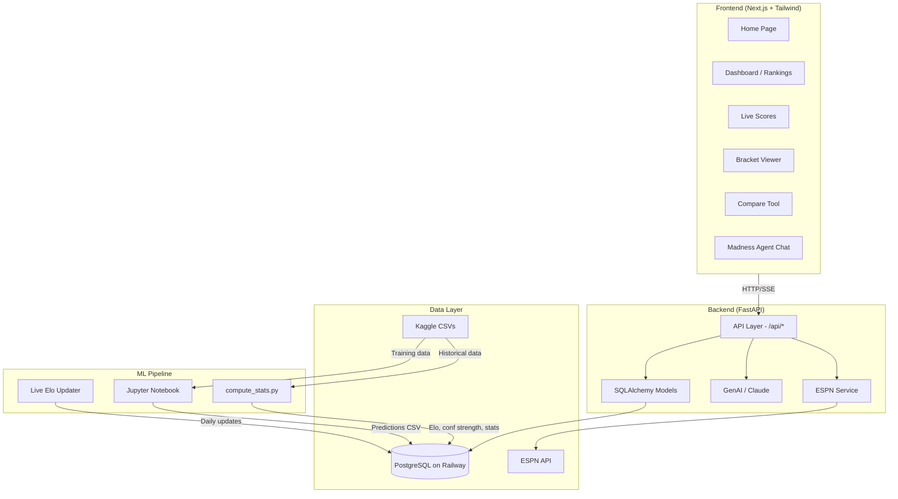
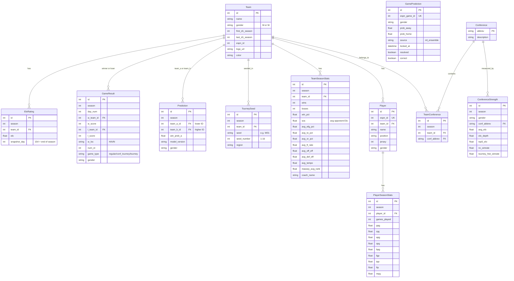

# Ubunifu Madness

AI-powered March Madness prediction platform that combines custom Elo ratings, a trained ML ensemble (LR + LightGBM), and live ESPN data to predict NCAA basketball tournament outcomes for both men's and women's basketball.

Built for the [Kaggle March Machine Learning Mania 2026](https://www.kaggle.com/competitions/march-machine-learning-mania-2026) competition and extended into a full-stack web application with live scores, power rankings, bracket visualization, performance tracking, and an AI analysis agent.

## Architecture



## Database Schema



## Tech Stack

| Layer | Technology |
|-------|-----------|
| Frontend | Next.js 16, React 19, Tailwind CSS 4, TypeScript |
| Backend | FastAPI, SQLAlchemy 2, Pydantic |
| Database | PostgreSQL (Railway) |
| ML | scikit-learn, LightGBM, Optuna, pandas, NumPy |
| AI Agent | Anthropic Claude (streaming SSE) |
| Live Data | ESPN API (scores, rankings, rosters, schedules) |
| Deployment | Railway (backend), Vercel (frontend) |

## Project Structure

```
ubunifu-madness/
├── backend/
│   ├── app/
│   │   ├── main.py                 # FastAPI app entry point
│   │   ├── config.py               # Environment settings
│   │   ├── database.py             # SQLAlchemy engine & session
│   │   ├── models/                 # 15 ORM models
│   │   │   ├── team.py             # Team with ESPN mapping
│   │   │   ├── elo_rating.py       # Elo snapshots per season/day
│   │   │   ├── game_result.py      # Historical + live game results
│   │   │   ├── prediction.py       # Static model predictions
│   │   │   ├── game_prediction.py  # Locked live predictions per game
│   │   │   ├── team_stats.py       # TeamSeasonStats (record, SOS, Four Factors)
│   │   │   ├── conference.py       # Conference + TeamConference
│   │   │   ├── conference_strength.py
│   │   │   ├── tournament.py       # TourneySeed
│   │   │   ├── player.py           # Player + PlayerSeasonStats
│   │   │   └── model_artifact.py   # Stored model metadata
│   │   ├── routers/                # 10 API routers
│   │   │   ├── teams.py            # Team search & details
│   │   │   ├── rankings.py         # Power & conference rankings
│   │   │   ├── predictions.py      # Head-to-head predictions
│   │   │   ├── compare.py          # Team comparison with stats
│   │   │   ├── bracket.py          # Tournament bracket & simulation
│   │   │   ├── chat.py             # AI Madness Agent (SSE streaming)
│   │   │   ├── espn.py             # Live ESPN data + admin endpoints
│   │   │   ├── players.py          # Player search & stats
│   │   │   └── performance.py      # Model accuracy tracking
│   │   └── services/
│   │       ├── espn.py             # ESPN API client with TTL cache
│   │       ├── predictor.py        # V5 ML ensemble predictor
│   │       ├── advanced_stats.py   # AdjEM, Barthag, power ratings
│   │       └── player_sync.py      # ESPN to DB player/stat sync
│   ├── scripts/
│   │   ├── compute_stats.py        # Elo + conference strength + team stats
│   │   ├── update_elo_live.py      # Live Elo updates from ESPN results
│   │   ├── cron_elo_update.py      # Daily cron wrapper (M+W)
│   │   ├── import_predictions.py   # Load predictions CSV into DB
│   │   ├── map_espn_ids.py         # Map Kaggle to ESPN team IDs
│   │   ├── seed_db.py              # Initial database seeding from CSVs
│   │   ├── update_detailed_stats.py # Refresh Four Factors from Kaggle
│   │   ├── backfill_espn_games.py  # Backfill missing ESPN game results
│   │   ├── regenerate_predictions.py  # Re-lock predictions for date range
│   │   ├── backtest_submissions.py    # Backtest Kaggle submissions
│   │   └── calibrate_submission.py    # Post-hoc calibration for Kaggle
│   └── requirements.txt
├── frontend/
│   ├── src/
│   │   ├── app/                    # Next.js App Router pages
│   │   │   ├── page.tsx            # Home
│   │   │   ├── dashboard/          # Power & conference rankings
│   │   │   ├── scores/             # Live ESPN scores with auto-refresh
│   │   │   ├── scores/[gameId]/    # Game detail with box score
│   │   │   ├── teams/              # Team directory
│   │   │   ├── teams/[id]/         # Team detail page
│   │   │   ├── compare/            # Head-to-head team comparison
│   │   │   ├── bracket/            # Tournament bracket viewer
│   │   │   ├── chat/               # AI Madness Agent
│   │   │   ├── performance/        # Model accuracy tracking
│   │   │   ├── about/              # Methodology documentation
│   │   │   └── terms/              # Terms & disclaimers
│   │   └── components/             # Shared UI components
│   └── package.json
├── notebooks/
│   └── Ubunifu_Madness_March_ML_Mania.ipynb
└── data/
    ├── raw/                        # Kaggle CSVs (not in git)
    └── espn_team_map.json          # ESPN to Kaggle ID mapping
```

## Quick Start

### Prerequisites

- Python 3.11+
- Node.js 18+
- PostgreSQL (or a Railway database URL)

### Backend

```bash
cd backend

# Create virtual environment
python3 -m venv .venv
source .venv/bin/activate

# Install dependencies
pip install -r requirements.txt

# Configure environment
cp .env.example .env
# Edit .env with your DATABASE_URL and ANTHROPIC_API_KEY

# Run the server
uvicorn app.main:app --reload --port 8000
```

### Frontend

```bash
cd frontend

# Install dependencies
npm install

# Configure API URL
# Create .env.local with:
# NEXT_PUBLIC_API_URL=http://localhost:8000

# Run dev server
npm run dev
```

The app is now available at `http://localhost:3000`.

### Data Pipeline (First-Time Setup)

1. Download Kaggle data: [March Machine Learning Mania 2026](https://www.kaggle.com/competitions/march-machine-learning-mania-2026/data) — place CSVs in `data/raw/`
2. Seed database: `cd backend && python3 -m scripts.seed_db`
3. Compute stats: `python3 -m scripts.compute_stats`
4. Map ESPN teams: `python3 -m scripts.map_espn_ids`
5. Load predictions: `python3 -m scripts.import_predictions ../submissions/stage2_submission_v5.csv`

## Key Features

- **Power Rankings** -- Composite power ratings (AdjEM 35%, Elo 25%, SOS 15%, Barthag 15%, Win% 5%, Momentum 5%) for 700+ teams (men's and women's), updated daily from ESPN results
- **Live Scores** -- Real-time ESPN scoreboard with Elo enrichment and ML ensemble win probabilities, locked before tipoff with post-game accuracy tracking
- **V5 ML Ensemble Predictions** -- LR (37.8%) + LightGBM (62.2%) ensemble with 40 features and smooth isotonic calibration. Validation Brier: 0.137, accuracy: 80%
- **Tournament Bracket** -- Full bracket visualization with model-predicted advancement probabilities via Monte Carlo simulation
- **Team Comparison** -- Side-by-side statistical breakdown (Four Factors, advanced efficiency, momentum, coaching) with head-to-head win probability and matchup explanation
- **Madness Agent** -- AI chat assistant (Claude Haiku) with 7 tools: team lookup, matchup predictions, conference analysis, rankings, live scores, upset candidates, bracket builder
- **Performance Tracking** -- Cumulative accuracy charts, daily breakdowns, calibration curves, and paginated game log. Predictions locked before tipoff, never changed retroactively
- **Tossup Handling** -- Games with <55% model confidence labeled as TOSSUP, excluded from accuracy metrics
- **Automated Daily Pipeline** -- Cron job updates Elo, game results, records, player stats, SOS, advanced stats (AdjEM, Barthag), power ratings, and locks predictions

## Model Performance

| Metric | Value |
|--------|-------|
| Validation Brier Score | **0.137** |
| Validation Accuracy | **80.0%** |
| Ensemble | LR (37.8%) + LightGBM (62.2%) |
| Features | 40 across 9 categories |
| Training Data | 163K games (2012-2025, all game types) |
| Calibration | Smooth isotonic (linear interpolation between step midpoints) |
| Training Weighting | Recency-weighted (5-season half-life, ~7x newest/oldest) |
| Live Prediction | V5 ML ensemble with fallback to Elo + record blend |

See [docs/MODEL.md](docs/MODEL.md) for the full breakdown.
