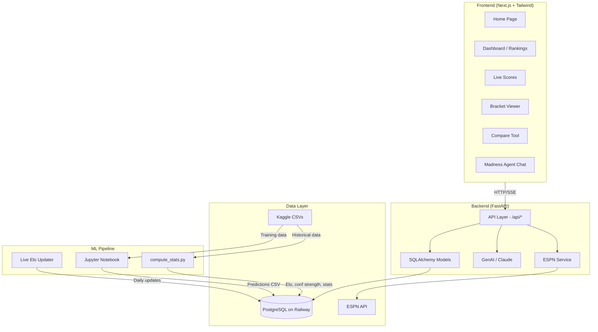
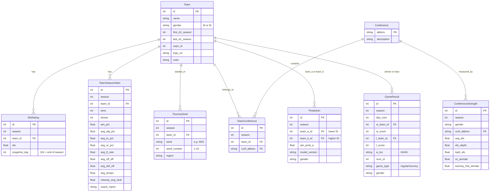

# Ubunifu Madness

AI-powered March Madness prediction platform that combines custom Elo ratings, advanced statistical modeling, and live ESPN data to predict NCAA basketball tournament outcomes.

Built for the [Kaggle March Machine Learning Mania 2025](https://www.kaggle.com/competitions/march-machine-learning-mania-2025) competition — and extended into a full-stack web application with live scores, power rankings, bracket visualization, and an AI analysis agent.

## Architecture



## Database Schema



## Tech Stack

| Layer | Technology |
|-------|-----------|
| Frontend | Next.js 16, React 19, Tailwind CSS 4, TypeScript |
| Backend | FastAPI, SQLAlchemy 2, Pydantic |
| Database | PostgreSQL (Railway) |
| ML | scikit-learn, LightGBM, Optuna, pandas, NumPy |
| AI Agent | Anthropic Claude (streaming SSE) |
| Live Data | ESPN API (scores, rankings, rosters, schedules) |
| Deployment | Railway (backend), Vercel (frontend) |

## Project Structure

```
ubunifu-madness/
├── backend/
│   ├── app/
│   │   ├── main.py                 # FastAPI app entry point
│   │   ├── config.py               # Environment settings
│   │   ├── database.py             # SQLAlchemy engine & session
│   │   ├── models/                 # 9 ORM models
│   │   ├── routers/                # 7 API routers (~30 endpoints)
│   │   │   ├── teams.py            # Team search & details
│   │   │   ├── rankings.py         # Power & conference rankings
│   │   │   ├── predictions.py      # Head-to-head predictions
│   │   │   ├── compare.py          # Team comparison with stats
│   │   │   ├── bracket.py          # Tournament bracket & simulation
│   │   │   ├── chat.py             # AI Madness Agent (SSE streaming)
│   │   │   └── espn.py             # Live ESPN data + admin endpoints
│   │   ├── services/
│   │   │   └── espn.py             # ESPN API client with TTL cache
│   │   └── genai/                  # Claude AI prompt engineering
│   ├── scripts/
│   │   ├── compute_stats.py        # Elo + conference strength + team stats
│   │   ├── update_elo_live.py      # Live Elo updates from ESPN results
│   │   ├── cron_elo_update.py      # Daily cron wrapper (M+W)
│   │   ├── load_predictions.py     # Load predictions CSV into DB
│   │   └── espn_team_mapper.py     # Map Kaggle ↔ ESPN team IDs
│   └── requirements.txt
├── frontend/
│   ├── src/
│   │   ├── app/                    # Next.js App Router pages
│   │   │   ├── page.tsx            # Home
│   │   │   ├── dashboard/          # Power & conference rankings
│   │   │   ├── scores/             # Live ESPN scores with auto-refresh
│   │   │   ├── bracket/            # Tournament bracket viewer
│   │   │   ├── compare/            # Head-to-head team comparison
│   │   │   ├── chat/               # AI Madness Agent
│   │   │   └── team/[id]/          # Team detail page
│   │   ├── components/             # Shared UI components
│   │   └── lib/                    # Types & utilities
│   └── package.json
├── notebooks/
│   └── Ubunifu_Madness_March_ML_Mania.ipynb
├── data/
│   ├── raw/                        # Kaggle CSVs (not in git)
│   └── espn_team_map.json          # ESPN ↔ Kaggle ID mapping
└── docs/
    ├── MODEL.md                    # ML pipeline deep-dive
    ├── RETRAINING.md               # Step-by-step retraining guide
    ├── API.md                      # Full API reference
    └── ROADMAP.md                  # Enhancement ideas
```

## Quick Start

### Prerequisites

- Python 3.11+
- Node.js 18+
- PostgreSQL (or a Railway database URL)

### Backend

```bash
cd backend

# Create virtual environment
python3 -m venv .venv
source .venv/bin/activate

# Install dependencies
pip install -r requirements.txt

# Configure environment
cp .env.example .env
# Edit .env with your DATABASE_URL and ANTHROPIC_API_KEY

# Run the server
uvicorn app.main:app --reload --port 8000
```

### Frontend

```bash
cd frontend

# Install dependencies
npm install

# Configure API URL
# Create .env.local with:
# NEXT_PUBLIC_API_URL=http://localhost:8000

# Run dev server
npm run dev
```

The app is now available at `http://localhost:3000`.

### Data Pipeline (First-Time Setup)

1. Download Kaggle data: [March Machine Learning Mania 2025](https://www.kaggle.com/competitions/march-machine-learning-mania-2025/data) — place CSVs in `data/raw/`
2. Compute stats: `cd backend && python3 -m scripts.compute_stats`
3. Map ESPN teams: `python3 -m scripts.espn_team_mapper`
4. Load predictions: `python3 -m scripts.load_predictions ../submissions/stage2_submission_v2.csv`

See [docs/RETRAINING.md](docs/RETRAINING.md) for the full pipeline walkthrough.

## Documentation

- **[Model Documentation](docs/MODEL.md)** — ML pipeline, feature engineering, model selection, calibration
- **[Retraining Guide](docs/RETRAINING.md)** — Step-by-step instructions for retraining with new data
- **[API Reference](docs/API.md)** — All backend endpoints with parameters and response shapes
- **[Roadmap](docs/ROADMAP.md)** — Enhancement ideas and future work

## Key Features

- **Power Rankings** — Custom Elo-based rankings for 700+ teams (men's and women's), updated daily from ESPN results
- **Live Scores** — Real-time ESPN scoreboard with Elo enrichment and model win probabilities, auto-refreshing every 30s
- **Tournament Bracket** — Full bracket visualization with model-predicted advancement probabilities via Monte Carlo simulation
- **Team Comparison** — Side-by-side statistical breakdown (Four Factors, efficiency, momentum, coaching) with head-to-head win probability
- **Madness Agent** — AI-powered chat assistant (Claude) with full access to team data, Elo ratings, and predictions for bracket analysis
- **Automated Elo Updates** — Daily cron job fetches ESPN game results and updates Elo ratings, conference strength, and team records

## Model Performance

| Metric | Value |
|--------|-------|
| Brier Score (calibrated) | **0.1607** |
| Ensemble | LR (76%) + LightGBM (24%) |
| Features | 27 across 7 categories |
| Calibration | Isotonic regression |
| CV Strategy | Leave-one-season-out (2015-2025) |

See [docs/MODEL.md](docs/MODEL.md) for the full breakdown.
