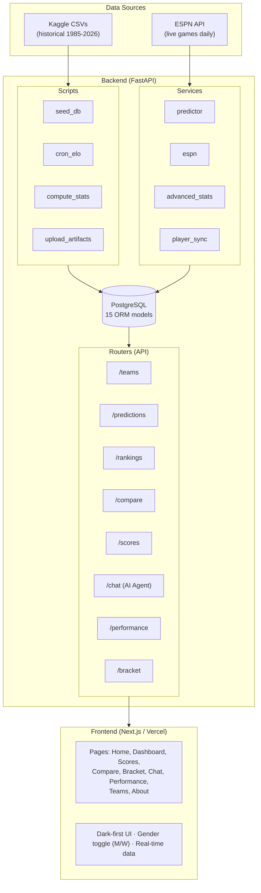
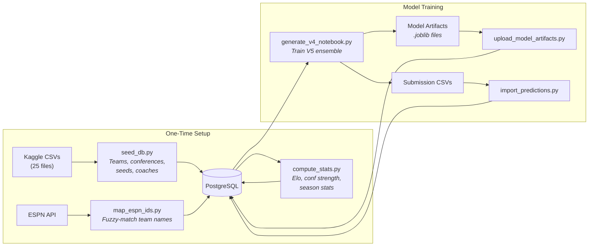
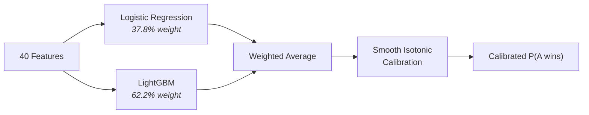
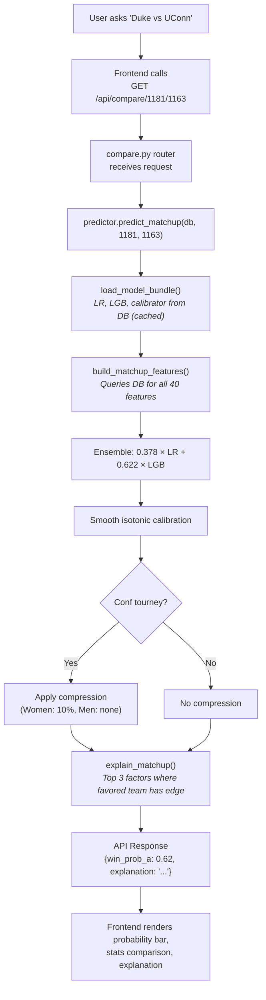
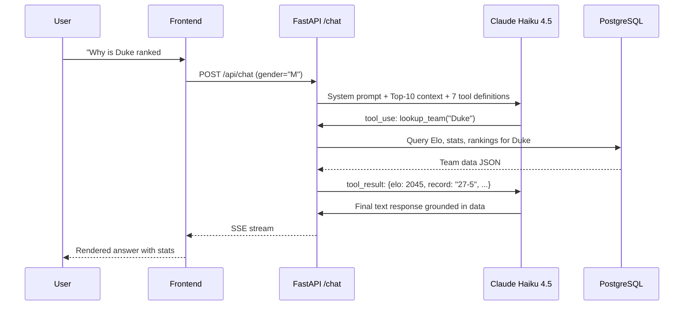
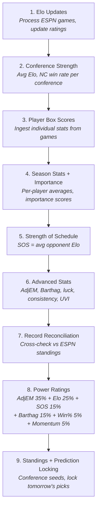
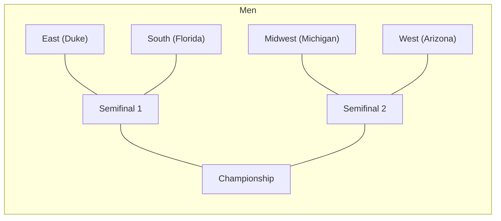
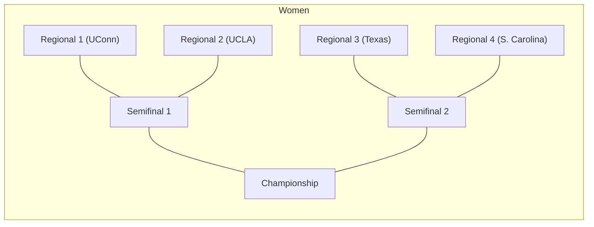

# Ubunifu Madness — Complete Learning Guide

A comprehensive guide to understanding, explaining, and extending the Ubunifu Madness NCAA basketball prediction platform — from data ingestion to deployed predictions.

---

## Table of Contents

1. [What Is This Project?](#1-what-is-this-project)
2. [Architecture Overview](#2-architecture-overview)
3. [Data Pipeline — Where the Data Comes From](#3-data-pipeline)
4. [Elo Rating System — The Foundation](#4-elo-rating-system)
5. [Feature Engineering — The 40 Features](#5-feature-engineering)
6. [The ML Model — Training, Ensemble, Calibration](#6-the-ml-model)
7. [Prediction Pipeline — From Model to User](#7-prediction-pipeline)
8. [Advanced Analytics — AdjEM, Barthag, Power Ratings](#8-advanced-analytics)
9. [The AI Agent — Claude with Tools](#9-the-ai-agent)
10. [Backend — FastAPI, Models, Routers, Services](#10-backend-deep-dive)
11. [Frontend — Next.js Pages and Components](#11-frontend-deep-dive)
12. [Daily Automation — The Cron Pipeline](#12-daily-automation)
13. [Key Technical Challenges & How We Solved Them](#13-key-challenges)
14. [Decisions and Trade-offs](#14-decisions-and-trade-offs)
15. [What I Would Improve Next](#15-future-improvements)
16. [Frequently Asked Questions](#16-frequently-asked-questions)
17. [File Reference](#17-file-reference)

---

## 1. What Is This Project?

Ubunifu Madness is an AI-powered NCAA basketball prediction platform built for the [Kaggle March Machine Learning Mania 2026](https://www.kaggle.com/competitions/march-machine-learning-mania-2026) competition. It predicts the probability that any team beats any other team in both men's and women's NCAA basketball.

**What makes it different from a Kaggle notebook:**
- It's a full-stack deployed application, not just a .ipynb
- Daily automated pipeline updates ratings, stats, and predictions from live ESPN data
- An AI chat agent (Claude) lets users ask natural-language questions about matchups
- A performance dashboard tracks every prediction against real outcomes — nothing is hidden

**The core problem:** Given Team A and Team B, output P(A wins) as a calibrated probability between 0 and 1.

**Evaluation metric:** Kaggle uses log-loss (cross-entropy). We also track Brier score (mean squared error of probabilities), accuracy, and calibration.

**Tech stack:** Next.js 16 (frontend) + FastAPI (backend) + PostgreSQL (database) + LightGBM/sklearn (ML) + Claude Haiku (AI agent). Deployed on Vercel + Railway.

---

## 2. Architecture Overview



**Key data flow:**
1. Historical Kaggle CSVs seed the database (one-time)
2. ESPN API provides daily live scores, rosters, box scores
3. The cron pipeline runs daily: updates Elo -> stats -> predictions
4. The ML model (trained offline in a notebook) produces win probabilities
5. Model artifacts are uploaded to the DB and loaded by the predictor service
6. The frontend calls the API and renders predictions, rankings, scores

---

## 3. Data Pipeline

### Where data comes from

**Historical (Kaggle CSVs — ~25 files):**
- Game results (compact + detailed box scores), 1985-2026
- Tournament seeds, brackets, and results
- Team conferences, coaches, Massey Ordinals (computer rankings)
- Both men's and women's datasets

**Live (ESPN API — daily):**
- Today's scoreboard (games, scores, status)
- Box scores (per-player stats after each game)
- Standings, rosters, AP rankings

### How data gets into the database



**Step 1 — Initial seeding** (`scripts/seed_db.py`):
Load teams, conferences, tournament seeds, coaches from Kaggle CSVs into PostgreSQL tables. This is a one-time operation.

**Step 2 — Compute historical stats** (`scripts/compute_stats.py`):
Process every game from 2012-2026 to compute:
- Elo ratings (iterating through every game chronologically)
- Conference strength metrics (avg Elo, non-conference win rate)
- Team season stats (record, Four Factors, efficiency)

**Step 3 — Map ESPN IDs** (`scripts/map_espn_ids.py`):
Kaggle and ESPN use different team IDs. This script fuzzy-matches team names and stores the mapping in `data/espn_team_map.json` and the `teams.espn_id` column.

**Step 4 — Train the model** (`notebooks/generate_v4_notebook.py`):
Generates and executes a Jupyter notebook that trains the V5 ensemble model. Outputs model artifacts (`.joblib` files) and submission CSVs.

**Step 5 — Upload artifacts** (`scripts/upload_model_artifacts.py`):
Serializes the trained LR, LightGBM, and calibrator models as binary blobs and stores them in the `model_artifacts` DB table with `is_active=True`.

**Step 6 — Import static predictions** (`scripts/import_predictions.py`):
Loads the submission CSV (all ~132K team pairs) into the `predictions` table for fast API lookups.

### Summary

The data pipeline starts with 25 raw CSV files and an external API, normalizes the data through computed features (Elo, advanced stats), trains an ML model, and serves live predictions through a REST API — all automated daily.

---

## 4. Elo Rating System

### What is Elo?

Elo is a dynamic rating system originally designed for chess. Every team starts at 1500. After each game, the winner gains points and the loser loses points. The amount depends on:
- How surprising the result was (upset = more Elo change)
- How big the margin of victory was
- Whether the winner was at home

### Our Elo parameters (Optuna-tuned)

| Parameter | Value | What it controls |
|-----------|-------|-----------------|
| K-Factor | 19.6 | Sensitivity to each game result (higher = more reactive) |
| Home Advantage | 90.9 | Elo points added for home team |
| Season Regression | 0.950 | How much rating carries over between seasons (1.0 = full carry) |
| Mean Elo | 1500 | Starting point for new teams |

### The update formula

```python
# Expected probability based on Elo difference
expected = 1 / (1 + 10^((elo_opponent - elo_team) / 400))

# Margin-of-victory multiplier (larger wins = bigger update, but diminishing)
mov_multiplier = log(|margin| + 1) * (2.2 / (|elo_diff| * 0.001 + 2.2))

# Elo change
delta = K * mov_multiplier * (actual_outcome - expected)
```

The `mov_multiplier` has an auto-correlation correction: `2.2 / (|elo_diff| * 0.001 + 2.2)`. This prevents the "strong team beats weak team by 30 -> gains too many points" problem. If a 2000-Elo team beats a 1200-Elo team by 30, the multiplier is dampened because that blowout was expected.

### Season regression

At the start of each season:
```python
new_elo = 1500 + 0.950 * (old_elo - 1500)
```

A team at 2000 regresses to 1975. This captures roster turnover, graduation, and transfers — but our high regression factor (0.95) reflects that in the NIL/transfer portal era, top programs stay elite year-over-year.

### Important nuance: gender separation

Men's and women's Elo pools are completely independent. Women's Elo runs ~245 points higher than men's because the competitive distribution is different (fewer teams, more dominant programs). You cannot compare men's 1800 to women's 1800 — they are different scales.

### Where to find this code

- Historical computation: `backend/scripts/compute_stats.py`
- Live updates: `backend/scripts/update_elo_live.py`
- Database model: `backend/app/models/elo.py`

---

## 5. Feature Engineering

### The philosophy

Every feature is computed as a **difference** between Team A and Team B: `feature_diff = team_a_value - team_b_value`. This transforms the problem from "how good is each team independently" to "how do they compare on each dimension." The model learns which dimensions matter most.

### All 40 features, explained

**Category 1: Elo (4 features)**

| Feature | What it captures |
|---------|-----------------|
| `elo_a` | Team A's current Elo rating |
| `elo_b` | Team B's current Elo rating |
| `elo_diff` | A's Elo minus B's Elo |
| `elo_prob` | Expected win probability from Elo alone (logistic of elo_diff/400) |

*Why include both raw values AND the diff?* The model can learn non-linear interactions. Maybe a team at 2100 beating a team at 1800 is different than 1600 vs 1300, even though the diff is the same.

**Category 2: Tournament Seeding (3 features)**

| Feature | What it captures |
|---------|-----------------|
| `seed_a`, `seed_b` | Tournament seed (1-16) — 0 if team not in tournament |
| `seed_diff` | Seed gap. A 1-vs-16 matchup has seed_diff = -15 |

*Why seeds matter:* Seeds encode expert committee judgment about team quality. They correlate with Elo but add independent information (committee watches games, considers injuries, momentum).

**Category 3: Conference Strength (3 features)**

| Feature | What it captures |
|---------|-----------------|
| `conf_avg_elo_diff` | Average Elo difference between conferences |
| `conf_nc_winrate_diff` | Non-conference win rate difference (how does each conference do outside its bubble) |
| `conf_tourney_hist_winrate_diff` | Historical NCAA tournament win rate by conference |

*Why conference context matters:* A 20-win team in the Big Ten is different from a 20-win team in a mid-major. Conference strength contextualizes individual team records.

**Category 4: Four Factors (10 features)**

The "Four Factors" are the core basketball analytics identified by Dean Oliver:

| Feature | What it measures | Why it matters |
|---------|-----------------|---------------|
| `efg_diff` | Effective FG% (weights 3s at 1.5x) | Shooting quality |
| `to_diff` | Turnover rate | Ball security |
| `or_diff` | Offensive rebound % | Second chances |
| `ftr_diff` | Free throw rate (FTA/FGA) | Ability to get to the line |
| `opp_efg_diff` | Opponent's eFG% (defensive) | How well you limit opponent shooting |
| `opp_to_diff` | Forced turnover rate | Defensive disruption |
| `off_eff_diff` | Offensive efficiency (points per 100 possessions) | Overall offensive quality |
| `def_eff_diff` | Defensive efficiency | Overall defensive quality |
| `tempo_diff` | Pace (possessions per game) | Style indicator |
| `win_pct_diff` | Win percentage | Overall quality signal |

*Why these are the most important features:* Research shows Four Factors explain ~90% of game outcomes. They capture what actually happens on the court, not just who won.

**Category 5: Ranking Systems (2 features)**

| Feature | What it captures |
|---------|-----------------|
| `massey_rank_diff` | Consensus of 50+ computer ranking systems (from Kaggle's Massey Ordinals) |
| `massey_disagreement_diff` | How much the ranking systems disagree about each team (stdev across systems) |

*Why disagreement matters:* If 50 computer rankings all agree a team is top-10, that's stronger signal than if half say top-5 and half say top-30. High disagreement = uncertain quality = higher variance in outcomes.

**Category 6: Momentum (3 features)**

| Feature | What it captures |
|---------|-----------------|
| `last_n_winpct_diff` | Last-10 games win percentage |
| `last_n_mov_diff` | Last-10 games average margin of victory |
| `efg_trend_diff` | Trend in shooting efficiency (improving or declining) |

*Why momentum matters:* Teams peak and valley during the season. A team that won 9 of their last 10 is in a different place than one that lost 5 of 10, even if their season records are similar.

**Category 7: Contextual (3 features)**

| Feature | What it captures |
|---------|-----------------|
| `coach_tenure_diff` | Years the current coach has been at this program |
| `conf_tourney_wins_diff` | Conference tournament wins this season |
| `sos_diff` | Strength of Schedule (average opponent Elo) |

*Why coach tenure:* Experienced coaches in their system tend to outperform in high-pressure tournament settings. A coach in year 10 has a different tournament track record than a first-year hire.

**Category 8: Game Context (4 features)**

| Feature | What it captures |
|---------|-----------------|
| `is_conf_tourney` | Is this a conference tournament game? (binary) |
| `is_ncaa_tourney` | Is this an NCAA tournament game? (binary) |
| `is_neutral_site` | Is this at a neutral venue? (binary) |
| `rest_days_diff` | Days of rest difference between teams |

*Why game context as features:* Conference tournaments play differently than the NCAA tournament (familiarity, rivalry intensity, auto-bid stakes). Neutral-site games remove home advantage. The model learns these effects rather than us hard-coding assumptions.

**Category 9: Quality & Rankings (8 features)**

| Feature | What it captures |
|---------|-----------------|
| `kenpom_rank_diff` | KenPom ranking difference (from Massey Ordinals) |
| `net_rank_diff` | NET ranking difference (NCAA's own metric) |
| `consensus_rank_diff` | Median across all ranking systems |
| `adj_eff_margin_diff` | Our computed AdjEM (opponent-adjusted efficiency margin) |
| `barthag_diff` | Barthag — probability of beating an average D1 team |
| `quality_win_pct_diff` | Win % against top-50 opponents |
| `win_pct_a`, `win_pct_b` | Raw win percentages for each team |

*Why so many ranking features:* Each ranking system captures slightly different information. KenPom emphasizes efficiency, NET weights game quality, our AdjEM adjusts for home court. The model learns which matters most in which context.

### Where to find this code

- Feature computation for training: `notebooks/generate_v4_notebook.py` (Part 3: Feature Engineering)
- Feature computation for live predictions: `backend/app/services/predictor.py` -> `build_matchup_features()`

---

## 6. The ML Model

### Why an ensemble?

No single model dominates. Logistic Regression captures linear relationships (Elo diff -> win probability) but misses interactions. LightGBM captures non-linear patterns (a 200-point Elo advantage matters more when both teams are elite) but can overfit on small tournament datasets. The ensemble combines their strengths.

### Model 1: Logistic Regression (37.8% weight)

- Standard sklearn LogisticRegression with L2 regularization
- Input: 40 standardized features
- Output: P(Team A wins)
- Strengths: Stable, interpretable, excellent at the "average" prediction
- Weakness: Can't capture feature interactions

### Model 2: LightGBM (62.2% weight)

A gradient-boosted decision tree ensemble. Hyperparameters tuned via Optuna (Bayesian optimization over 200 trials):

| Parameter | Value | Why |
|-----------|-------|-----|
| n_estimators | 266 | Enough trees to learn patterns, not so many that it overfits |
| max_depth | 5 | Shallow trees prevent memorizing specific matchups |
| learning_rate | 0.0111 | Slow learning = better generalization |
| num_leaves | 59 | Controls tree complexity |
| min_child_weight | 3.5 | Minimum samples per leaf — prevents fitting noise |
| subsample | 0.886 | Random 89% of data per tree — reduces overfitting |
| colsample_bytree | 0.757 | Random 76% of features per tree — decorrelates trees |

- Strengths: Captures non-linear interactions, handles missing values, fast
- Weakness: Can overfit on small datasets, less interpretable

### How the ensemble works



```python
# Get raw predictions from both models
lr_prob = lr_model.predict_proba(features)[0][1]
lgb_prob = lgb_model.predict_proba(features)[0][1]

# Weighted average (Nelder-Mead optimized weights)
raw_prob = 0.378 * lr_prob + 0.622 * lgb_prob

# Calibrate
calibrated_prob = smooth_calibrate(raw_prob)
```

### Ensemble weight optimization

The weights (37.8% LR, 62.2% LGB) were found using Nelder-Mead optimization on the out-of-fold predictions from cross-validation. The objective was to minimize Brier score on tournament games specifically.

### Cross-validation: Leave-One-Season-Out (LOSO)

Standard k-fold doesn't work here because basketball seasons are not independent — tactics, rules, and team compositions evolve over time. LOSO trains on all seasons except one, then evaluates on that held-out season:

```
Fold 1: Train on 2012-2014, 2016-2025 -> Test on 2015
Fold 2: Train on 2012-2015, 2017-2025 -> Test on 2016
...
Fold 9: Train on 2012-2024 -> Test on 2025
(2020 skipped — COVID, no tournament)
```

This gives us 9 honest evaluations where the model has never seen any game from the test season.

### Recency weighting (V5 improvement)

Basketball has changed. The 3-point revolution, transfer portal, and NIL have made recent seasons more predictive of future outcomes than older ones. We apply exponential decay sample weights during training:

```python
weight = 2^(-(current_season - game_season) / half_life)
# half_life = 5 seasons

# Example weights:
# 2025 game: weight = 1.0
# 2020 game: weight = 0.5
# 2015 game: weight = 0.25
# 2012 game: weight = 0.14
```

A 2025 game counts ~7x more than a 2012 game. This is passed via `sample_weight` to both LR and LightGBM.

### Calibration: The critical step

**Problem:** Raw model outputs are not calibrated probabilities. If the model says "70%", teams at that confidence level might actually win only 65% of the time. Calibration fixes this.

**Method:** Isotonic regression trained on out-of-fold predictions. Isotonic regression is a non-parametric method that fits a monotonic (always increasing) function mapping raw -> calibrated probabilities.

**The clustering problem:** With only ~900 OOF tournament predictions, isotonic regression produced just 15-17 discrete steps. A 62% and 68% raw prediction both mapped to the same calibrated value.

**Our fix — smooth calibration:**
```python
# Instead of using the step function directly:
# calibrated = calibrator.predict(raw)  ← produces clustered values

# We interpolate between step midpoints:
step_midpoints_x = [(step_start + step_end) / 2 for each step]
step_values_y = [step_output for each step]
calibrated = np.interp(raw, step_midpoints_x, step_values_y)
```

This preserves the calibrator's learned mapping while producing continuous (non-clustered) outputs. Result: 15 unique values -> 50+ unique values.

### Conference tournament compression

After calibration, we apply a compression factor for conference tournament games. Why? Conference tournaments have higher variance — teams know each other intimately, rivalry dynamics create upsets, and auto-bid pressure changes motivation.

```python
if is_conf_tourney:
    gender = get_team_gender(team_a_id)
    factor = 0.90 if gender == "W" else 1.0  # Women: 10% compression, Men: none
    prob = 0.5 + (prob - 0.5) * factor
```

Men's conference tournaments don't need compression (our calibration analysis showed the model is already well-calibrated). Women's need 10% compression toward 50%.

### Performance

| Metric | Value |
|--------|-------|
| Validation Brier Score | 0.137 |
| Validation Accuracy | 80.0% |
| Best Tournament Season | 2025: Brier 0.126, 85.8% accuracy |
| Live Accuracy (2026) | ~69-70% (includes tossups excluded from official metrics) |

### Where to find this code

- Training pipeline: `notebooks/generate_v4_notebook.py`
- Live prediction: `backend/app/services/predictor.py`
- Model artifacts in DB: `backend/app/models/model_artifact.py`
- Artifact upload: `backend/scripts/upload_model_artifacts.py`

---

## 7. Prediction Pipeline

### How a prediction goes from model to user



### The 3-layer prediction cascade

1. **ML Ensemble** (primary): If model artifacts are loaded, use the full 40-feature ensemble
2. **Elo + Record blend** (fallback): If artifacts fail, blend Elo probability (50%) + SOS-adjusted record (40%) + analytics (10%)
3. **Coin flip** (last resort): If no data at all, return 0.5

### Prediction locking

For live games, predictions are "locked" before tipoff and stored in the `game_predictions` table. This is critical for honest performance tracking — you can't retroactively adjust predictions after seeing the result.

```python
# In the cron pipeline:
existing = db.query(GamePrediction).filter(game_id=espn_game_id).first()
if existing:
    return  # Already locked — never overwrite

# Lock the prediction
prediction = GamePrediction(
    game_id=espn_game_id,
    prob_away=prob,
    source="ml_ensemble",
    locked=True,
    explanation=explanation,
)
db.add(prediction)
```

### Tossup handling

When the model's confidence is below 55% (neither team favored above 55%), the game is labeled a **TOSSUP**:
- Displayed in yellow on the scores page (instead of picking a winner)
- Excluded from accuracy metrics on the performance page
- The model is honest about when it doesn't have a strong pick

### Where to find this code

- Prediction logic: `backend/app/services/predictor.py`
- Compare endpoint: `backend/app/routers/compare.py`
- Prediction locking: `backend/app/routers/espn.py` -> `_lock_predictions()`
- GamePrediction model: `backend/app/models/game_prediction.py`

---

## 8. Advanced Analytics

### AdjEM (Adjusted Efficiency Margin)

Raw offensive/defensive efficiency doesn't account for opponent quality. A team with 110 points per 100 possessions against weak opponents is different from one achieving 105 against elite defenses.

**How we compute it:**
1. Start with raw offensive/defensive efficiency for every team
2. Iteratively adjust: if you scored 110 against a team with defense ranked 5th, that's more impressive than 110 against a team ranked 300th
3. Repeat for 10 iterations until values converge

```python
for iteration in range(10):
    for team in all_teams:
        # Adjust offense by opponent defensive strength
        adj_oe = raw_oe * (national_avg_de / avg_opponent_adj_de)
        # Adjust defense by opponent offensive strength
        adj_de = raw_de * (national_avg_oe / avg_opponent_adj_oe)

    AdjEM = adj_oe - adj_de  # Positive = good, negative = bad
```

**V5 home court adjustment:** Before aggregation, we adjust each game's efficiency by ±3.5 points per 100 possessions (KenPom-style). Home teams have their offense deflated by 1.75 and defense inflated by 1.75. This neutralizes venue advantage so AdjEM reflects true team quality.

### Barthag

Barthag estimates the probability a team would beat an average D1 team:

```python
Barthag = AdjOE^11.5 / (AdjOE^11.5 + AdjDE^11.5)
```

The exponent 11.5 comes from empirical basketball research. A team with AdjOE=110 and AdjDE=95 has Barthag ≈ 0.95 (beats an average team 95% of the time).

### Power Ratings

Our composite power rating blends multiple metrics:

| Component | Weight | Why |
|-----------|--------|-----|
| AdjEM | 35% | Best single predictor of game outcomes |
| Elo | 25% | Captures long-term trajectory and game-by-game results |
| SOS | 15% | Schedule difficulty matters — contextualizes record |
| Barthag | 15% | Non-linear version of efficiency — rewards elite teams |
| Win % | 5% | Simple but meaningful — wins matter |
| Momentum | 5% | Recent form (last-10 games) |

**50% efficiency-based** (AdjEM + Barthag), **25% Elo**, **15% SOS** — this balances predictive efficiency metrics with Elo's game-by-game trajectory and schedule strength context.

### Upset Vulnerability Index

A composite score (0-100) predicting how likely a team is to lose as a favorite:

- High margin variability (inconsistent performance)
- High "luck" (winning more than Pythagorean expectation suggests)
- High three-point dependency (3-point shooting has high variance)
- Poor free throw shooting (can't close close games)

### Where to find this code

- Advanced stats computation: `backend/app/services/advanced_stats.py`
- Power ratings: `backend/scripts/cron_elo_update.py` -> Stage 8
- TeamSeasonStats model: `backend/app/models/team_stats.py`

---

## 9. The AI Agent

### Architecture

The Madness Agent uses Claude Haiku 4.5 with native tool-use (not LangGraph or LangChain). Claude decides which tools to call based on the user's question, then synthesizes a grounded answer.



### The 7 tools

| Tool | Purpose | When Claude uses it |
|------|---------|-------------------|
| `lookup_team` | Get team Elo, record, Four Factors, seeds, advanced stats | "Tell me about Gonzaga" |
| `get_matchup_prediction` | Head-to-head win probability with explanation | "Duke vs UConn who wins?" |
| `get_conference_info` | Conference strength metrics, team list | "How strong is the Big Ten?" |
| `get_top_teams` | Power rankings (top N by Elo) | "Who are the best teams?" |
| `get_todays_scores` | Live ESPN scores with predictions | "What are today's scores?" |
| `get_upset_candidates` | Games where underdog has >30% chance | "Find me upsets" |
| `build_bracket` | Fill out all 63 tournament games | "Build my bracket" |

### Why native tool-use instead of LangGraph?

LangGraph adds complexity (state machines, edges, nodes) that wasn't needed. Claude's native tool-use API is simpler:
1. Send tools as JSON schemas in the API call
2. Claude returns `tool_use` blocks when it wants to call a tool
3. We execute the tool and send results back
4. Claude generates the final response

This keeps the code in a single file (~900 lines) rather than spreading across a LangGraph graph definition, tool nodes, and state schemas.

### Rate limiting

Three tiers to prevent abuse:
- 10 messages per 10 minutes (burst protection)
- 30 messages per hour
- 100 messages per day

### Gender context

The frontend sends `gender: "M"` or `gender: "W"` with every chat request. All tool executions automatically filter by this gender. The agent never needs to ask "men's or women's?" — the user has already selected it via the toggle.

### Where to find this code

- Agent endpoint + tool definitions + execution: `backend/app/routers/chat.py`
- Prediction logic called by agent: `backend/app/services/predictor.py`
- Frontend chat UI: `frontend/src/app/chat/page.tsx`

---

## 10. Backend Deep Dive

### Database Models (15 tables)

| Model | Table | Key columns | Purpose |
|-------|-------|-------------|---------|
| Team | teams | id, name, gender, espn_id | All D1 teams |
| EloRating | elo_ratings | team_id, season, snapshot_day, elo | Elo snapshots |
| GameResult | game_results | season, w_team_id, l_team_id, w_score, l_score | Game outcomes |
| Prediction | predictions | team_a_id, team_b_id, win_prob_a | Static model predictions (all pairs) |
| GamePrediction | game_predictions | espn_game_id, prob_away, winner_team_id | Locked live predictions |
| TeamSeasonStats | team_season_stats | team_id, season, wins, losses, all Four Factors, AdjEM, power_rating | Aggregated stats |
| TourneySeed | tourney_seeds | team_id, season, seed, region | Tournament seeds |
| Conference | conferences | abbrev, description | Conference definitions |
| TeamConference | team_conferences | team_id, season, conf_abbrev | Membership |
| ConferenceStrength | conference_strength | conf_abbrev, season, avg_elo | Conference metrics |
| ConferenceStanding | conference_standings | team_id, conf_seed, conf_record | Within-conference standings |
| Player | players | espn_id, team_id, name, position, jersey | Player roster |
| PlayerSeasonStats | player_season_stats | player_id, season, ppg, rpg, apg | Per-player averages |
| ModelArtifact | model_artifacts | name, version, blob, is_active | Stored model files |
| User / UserBracket | users, user_brackets | email, picks | Bracket persistence |

### Key design decisions

**Prediction normalization:** Predictions always use `team_a_id < team_b_id` (lower ID first). This prevents duplicate entries (Duke vs UConn and UConn vs Duke are the same matchup).

**Immutable GamePredictions:** Once a prediction is locked before tipoff, it is never changed. This is essential for honest performance tracking.

**Gender as a column, not a heuristic:** Early versions used `team_id < 3000` to determine gender. We moved to an explicit `Team.gender` column because it's more reliable and readable.

### API Routers

| Router | Base path | Key endpoints |
|--------|-----------|--------------|
| teams | /api/teams | GET /, GET /{id} — search and detail |
| predictions | /api/predictions | GET /{a}/{b} — head-to-head probability |
| rankings | /api/rankings | GET /power, /conferences, /conference-standings |
| compare | /api/compare | GET /{a}/{b} — full comparison with stats diffs |
| bracket | /api/bracket | GET /full, /matchups, POST /simulate |
| chat | /api/chat | POST / — AI agent with SSE streaming |
| espn | /api/scores | GET /, GET /{id} — live scores from ESPN |
| performance | /api/performance | GET /summary, /game-log — accuracy tracking |
| players | /api/players | GET / — player stats and importance |

### Services layer

- **predictor.py**: The prediction engine (model loading, feature building, ensemble, calibration)
- **espn.py**: ESPN API client with TTL caching (30-second cache to avoid hammering ESPN)
- **advanced_stats.py**: AdjEM, Barthag, upset vulnerability, consistency metrics
- **player_sync.py**: Player data ingestion and importance scoring
- **style_analysis.py**: Matchup style analysis (pace, shooting, defense profiles)

---

## 11. Frontend Deep Dive

### Pages

| Page | Route | What it shows |
|------|-------|--------------|
| Home | `/` | Hero section, model accuracy stats, feature cards, live accuracy counter |
| Dashboard | `/dashboard` | Sortable power rankings table, conference standings, filterable by conference |
| Live Scores | `/scores` | Today's games from ESPN, with Elo-enriched predictions, AP rankings |
| Score Detail | `/scores/[gameId]` | Full box score, team stats comparison, our prediction vs result |
| Teams | `/teams` | Paginated team directory with search |
| Team Detail | `/teams/[id]` | Team profile: Elo, Four Factors, conference, recent games |
| Compare | `/compare` | Side-by-side team comparison with stat diffs and prediction |
| Bracket | `/bracket` | Interactive 64-team bracket with Monte Carlo simulation |
| Chat | `/chat` | AI Madness Agent chat interface |
| Performance | `/performance` | Daily accuracy chart, calibration curve, game-by-game log |
| Players | `/players` | Player leaderboard by stats or importance |
| About | `/about` | Full methodology explanation, V5 model details |

### Key frontend patterns

**Gender toggle:** A persistent M/W toggle in the nav bar. Stored in localStorage via the `useGender` hook. Every API call includes the selected gender.

**Dark-first UI:** The entire app is designed for dark mode first (dark backgrounds, light text). This is an aesthetic choice matching the "March Madness analytics" vibe.

**Real-time scores:** The scores page polls the backend every 30 seconds for live game updates. Games in progress show live scores with updating probabilities.

**Bracket interaction:** Users can click to pick winners in each round. A Monte Carlo simulation (run server-side) shows championship probabilities for each team. Picks are stored in localStorage (with optional email-based cloud save).

---

## 12. Daily Automation

### The cron pipeline (`scripts/cron_elo_update.py`)

Runs daily at 6 AM. Nine sequential stages, each building on the previous:



### Why this order matters

Each stage depends on the previous:
- Elo must be updated before SOS (SOS uses opponent Elo)
- SOS must be computed before advanced stats (AdjEM uses opponent quality)
- Advanced stats must exist before power ratings (power rating formula uses AdjEM + Barthag)
- All stats must be current before predictions are locked

### Idempotency

The pipeline is designed to be safe to re-run:
- Elo updates deduplicate by ESPN game ID (won't process the same game twice)
- Prediction locking checks for existing predictions before inserting
- Stats computations are full refreshes (replace old values)

---

## 12b. Bracket Generation — Model, Agent, and Consensus

The app generates three types of official brackets, each using a different strategy. All three use the live V5 ML ensemble predictor for win probabilities, applied to NCAA tournament matchups (neutral site, tournament context flags enabled).

### Model Bracket (Chalk)

The model bracket always picks the higher-probability team. No randomness, no upsets -- pure chalk.

```
Algorithm:
  For each matchup (starting from Round of 64):
    prob_a = predict_matchup(team_a, team_b, is_ncaa_tourney=True, is_neutral=True)
    winner = team_a if prob_a >= 0.5 else team_b
    Advance winner to next round
  Repeat through R32, Sweet 16, Elite 8, Final Four, Championship
```

This produces a bracket that represents what our model thinks is the most likely outcome at every decision point. It will rarely match reality because upsets happen, but it serves as the "baseline expectation."

### Agent Bracket (Balanced Upsets)

The agent bracket introduces controlled randomness to simulate realistic upset potential. It uses the model's probabilities but occasionally picks the underdog.

```
Algorithm:
  For each matchup:
    prob_a = predict_matchup(team_a, team_b, is_ncaa_tourney=True, is_neutral=True)

    Identify favorite and underdog:
      if prob_a >= 0.5: favorite = team_a, underdog_prob = 1 - prob_a
      else:             favorite = team_b, underdog_prob = prob_a

    Pick the underdog if BOTH conditions are met:
      1. underdog_prob >= 0.35 (underdog has a realistic chance)
      2. random() < 0.30 (30% dice roll)

    Otherwise pick the favorite
```

This means:
- Heavy favorites (>65% win probability) are almost never upset
- Competitive matchups (35-50% underdog probability) have a ~30% chance of the underdog advancing
- The bracket will have some upsets but won't be chaotic

### Consensus Bracket (Model + Agent Combined)

The consensus bracket merges the model and agent brackets, resolving disagreements using the model's prediction probability.

```
Algorithm:
  Load model_bracket.picks and agent_bracket.picks

  For each slot (63 total):
    if model_pick == agent_pick:
      consensus_pick = model_pick  (high confidence -- both agree)
    else:
      prob = predict_matchup(model_pick, agent_pick)
      consensus_pick = model_pick if prob >= 0.5 else agent_pick
      Mark slot as "contested"

  Report: agreement_pct, contested_slots, contested_details
```

The consensus bracket tracks metadata:
- `agreed_slots`: number of slots where model and agent made the same pick
- `contested_slots`: number of disagreements
- `agreement_pct`: percentage of agreement (typically 85-95%)
- `contested_details`: list of slot IDs where they disagreed

### Final Four Pairings

The bracket structure connects regions to Final Four semifinals. These pairings are gender-specific and set by the NCAA:





### First Four (Play-In Games)

Before the Round of 64, 8 teams play 4 "First Four" games. Each First Four game feeds into a specific region and seed slot:
- Winners fill the TBD slot in their assigned R64 matchup
- Until the game is played, the bracket shows both play-in teams (e.g., "Prairie View / Lehigh")
- Once played, the winner automatically replaces the TBD slot

### Bracket Locking

Official brackets (Model, Agent, Consensus) are generated once and stored permanently in the `official_brackets` table. They cannot be regenerated without an admin reset. This ensures the brackets are an honest record of what our system predicted before the tournament started.

User brackets ("My Bracket") are stored in the browser's localStorage and can be modified freely until the tournament begins.

### Where to find this code

- Bracket generation: `backend/app/routers/bracket.py` -> `generate_official_bracket()`, `generate_consensus_bracket()`
- Final Four pairings: `backend/app/routers/bracket.py` -> `FF_PAIRINGS_M`, `FF_PAIRINGS_W`
- Bracket display: `backend/app/routers/bracket.py` -> `full_bracket()`
- Frontend bracket UI: `frontend/src/app/bracket/page.tsx`
- Admin controls: `backend/app/routers/admin.py`, `frontend/src/app/admin/page.tsx`

---

## 13. Key Technical Challenges

### Challenge 1: Isotonic Calibration Clustering

**The problem:** Our calibrator grouped all predictions into 15 discrete values. Different matchups showed identical probabilities.

**Root cause:** Isotonic regression on ~900 samples creates a coarse step function.

**Solution:** Linear interpolation between step midpoints. Preserves calibration while producing continuous outputs.

**Lesson:** Non-parametric calibration on small datasets needs smoothing. This is a known issue in ML but rarely discussed in tutorials.

### Challenge 2: Conference Tournament Overconfidence

**The problem:** Model trained primarily on NCAA tournament games was overconfident on conference tournament games. 60-70% predictions only hit ~45% actual win rate.

**Root cause:** Domain shift. Conference tournaments are structurally different — teams know each other, rivalry dynamics, different motivation (auto-bid vs comfort seeding).

**Evolution of solutions:**
- V3: Hard-coded 0.80 compression factor (crude but effective)
- V4: Added `is_conf_tourney` as a training feature (model learns the effect)
- V5: Feature + gender-specific post-calibration compression (Men: none, Women: 10%)

**Lesson:** Domain shift is real in production ML. Sometimes you need multiple approaches — let the model learn what it can, then apply post-hoc corrections for what it can't.

### Challenge 3: Training Data Regime Shift

**The problem:** V2 trained on 2003-2025 performed worse than V3 trained on 2012-2025 only. More data wasn't better.

**Root cause:** Basketball fundamentally changed:
- 2012+: Three-point revolution (20 -> 30+ attempts/game)
- 2018+: Transfer portal (massive roster turnover)
- 2021+: NIL (talent redistribution)

Pre-2012 games taught the model patterns that no longer apply.

**Solution:** Restrict training to 2012+ (modern era) and apply recency weighting with a 5-season half-life. Recent games matter ~7x more than 2012 games.

**Lesson:** In time-series ML, older data can actively hurt. Recency weighting is more principled than hard cutoffs.

### Challenge 4: Head-to-Head Label Leakage

**The problem:** Adding head-to-head season record as a feature boosted conference tournament accuracy to 99.4% — clearly overfitting.

**Root cause:** If Duke beat UNC twice in the regular season, the H2H feature is `1.0`. When they meet in the ACC tournament, the model already "knows" Duke wins because the season series is a near-perfect predictor of the rematch. This is label leakage — the feature encodes the outcome.

**Solution:** Removed H2H from training entirely. Kept it only in the `explain_matchup` function for user-facing explanations (where leakage doesn't matter).

**Lesson:** Features that seem predictive can be causally polluted. Always check if a feature would be available at prediction time without knowledge of the outcome.

### Challenge 5: Explain-Predict Consistency

**The problem:** Locked prediction showed "Arizona 79%" but the explanation said "Iowa St favored." The explanation function was calling the prediction function independently and getting a different probability (because it didn't pass the `is_conf_tourney` flag).

**Solution:** Modified `explain_matchup()` to accept the pre-computed probability as a parameter instead of recalculating.

**Lesson:** In production ML, explanation and prediction must use the same inputs. If they diverge, users lose trust.

---

## 14. Decisions and Trade-offs

### "Why not use player-level features?"

Kaggle's historical data has zero player information. We have live ESPN player data for 2026 only. You can't train on features that don't exist historically. We'd need 14 seasons of player-level data to train meaningfully with LOSO cross-validation.

### "Why not use betting lines as a feature?"

Vegas lines are the single best predictor of game outcomes (~74% accuracy). Adding them would boost performance. We chose not to because:
1. It would make our model a "line follower" rather than an independent predictor
2. The interesting question is: how well can we predict using only basketball data?
3. Kaggle doesn't provide lines as training data

### "Why Elo and not just ranking systems?"

Elo is computed from first principles — we control every parameter. Massey Ordinals (ranking systems) are black boxes maintained by others. Elo gives us a continuous, game-by-game updated signal that we understand completely.

### "Why not just use KenPom rankings?"

KenPom rankings are in our feature set (via Massey Ordinals). But they're one input among 40. Our model learns how to weight KenPom against other signals. In some contexts (early season, mid-majors), KenPom is less reliable and other features dominate.

### "Why an AI agent instead of just dashboards?"

Dashboards show data. An agent explains it. When a user asks "why is Duke ranked #3?", a dashboard shows them 40 stats and leaves them to figure it out. The agent looks up Duke's stats, identifies the top factors, and gives a concise human-readable answer.

### "Why lock predictions before tipoff?"

Intellectual honesty. If you allow retroactive adjustments, you can make your accuracy look arbitrarily good. Locking predictions creates an auditable track record. The performance page shows every prediction — right and wrong.

---

## 15. Future Improvements

### High impact, feasible

1. **Calibration correction for Kaggle submissions** — Our model is systematically underconfident in the 70-85% band. A post-hoc correction on the submission CSV (clip extremes, adjust the calibration curve) could improve log-loss by 0.01-0.02.

2. **Player-level adjustments (live only)** — Use ESPN player data to compute team-level aggregates:
   - Star concentration (% of production from top 2 players)
   - Roster experience (average years weighted by minutes)
   - Depth score (minutes entropy)
   - Apply as a multiplier on model predictions, can't train on but can use as live adjustment

3. **More ranking system features** — Massey Ordinals contains 50+ ranking systems. We use consensus + disagreement. Could add specific systems (Sagarin, BPI) as individual features.

### High impact, harder

4. **Injury data integration** — The single biggest gap vs Vegas. Would need an external data source (ESPN injury reports are sparse). Even a simple "star player out -> reduce win probability by X%" would help.

5. **Play-by-play data** — Possession-level efficiency, shot quality, lineup data. Would require a new data source and significant feature engineering.

### Medium impact

6. **Tempo mismatch feature** — `|tempo_a - tempo_b|` captures that extreme pace mismatches create variance (benefits underdogs).

7. **Tournament-specific features** — Distance to game site, conference representation in region, historical performance at specific venues.

---

## 16. Frequently Asked Questions

### What does this project do?

Ubunifu Madness is an end-to-end NCAA basketball prediction platform built for the Kaggle March Machine Learning Mania competition. It uses a LightGBM + Logistic Regression ensemble trained on 163,000 games with 40 features covering Elo ratings, efficiency metrics, and conference strength. The model achieves 80% accuracy on held-out tournament games. Beyond the model, there is a full-stack app with Next.js and FastAPI that shows live predictions, power rankings, and has an AI chat agent powered by Claude that can answer natural-language basketball questions using six data tools. The entire pipeline — Elo updates, stats computation, prediction locking — runs automatically every day.

### "What was the hardest technical challenge?"

"Calibration. The raw model outputs weren't well-calibrated — it would say 70% but teams at that confidence only won 65% of the time. I used isotonic regression for calibration, but with only 900 training samples, it produced a coarse step function that clustered predictions into 15 discrete values. I solved this by implementing smooth calibration — linear interpolation between the isotonic step midpoints. This preserved the calibration mapping while producing continuous outputs. Then I discovered conference tournament games had a different calibration profile than NCAA tournament games due to domain shift, which required gender-specific post-calibration compression."

### "How do you handle the train/deploy gap?"

"Three ways. First, I train on all game types (regular season + conference tournament + NCAA tournament) with game-type flags as features, so the model learns domain-specific patterns. Second, I apply recency weighting with a 5-season half-life — recent games count ~7x more than 2012 games, which handles the regime shift from the 3-point revolution, transfer portal, and NIL. Third, the daily cron pipeline recomputes all features from live data, so predictions always use current-season stats."

### "Why not use a more complex model architecture?"

"I tried. The ensemble of Logistic Regression + LightGBM with isotonic calibration outperformed deeper approaches on our dataset. The key insight is that with ~900 tournament games for evaluation, model complexity is limited by data quantity, not model capacity. LightGBM with 266 trees and max depth 5 already captures the relevant non-linear interactions. Adding more complexity (deeper trees, neural networks) overfits to training set peculiarities."

### "How does the AI agent work?"

"It uses Claude's native tool-use API — no framework like LangGraph. I define seven tools as JSON schemas (lookup team, get prediction, conference info, rankings, scores, upset candidates, bracket builder). When a user asks a question, Claude decides which tools to call, I execute them against the database and return structured JSON, then Claude synthesizes a grounded response. The key design decision was to keep everything in a single endpoint with streaming SSE responses, which keeps the code simple (~900 lines) and the latency low."

### "What would you do differently if starting over?"

"I'd invest earlier in calibration analysis. We spent weeks tuning features and hyperparameters, but the biggest accuracy improvements came from calibration fixes — smoothing the isotonic step function and adding conference tournament compression. I'd also build the performance dashboard first. Having an honest, public leaderboard of every prediction forced rigor — you can't hide bad predictions when they're displayed on a game-by-game log."

### "How do you evaluate model performance?"

"Leave-One-Season-Out cross-validation. For each of 9 tournament seasons (2015-2025, excluding 2020), I train on all other seasons and predict the held-out season. This gives honest estimates because the model has never seen any game from the test season. Primary metrics are Brier score (calibration quality) and accuracy. In production, I also track daily calibration curves, per-confidence-band accuracy, and maintain a game log where every prediction is recorded before tipoff and compared to the actual result."

---

## 17. File Reference

### Backend

```
backend/
├── app/
│   ├── main.py                  # FastAPI entry, router registration, CORS
│   ├── config.py                # Environment settings (DB URL, API keys, season)
│   ├── database.py              # SQLAlchemy engine + session setup
│   │
│   ├── models/                  # Database ORM models
│   │   ├── __init__.py          # Exports all models
│   │   ├── team.py              # Team (id, name, gender, espn_id)
│   │   ├── elo.py               # EloRating (team_id, season, day, elo)
│   │   ├── game_result.py       # GameResult (season, teams, scores, game_type)
│   │   ├── prediction.py        # Prediction (static all-pairs probabilities)
│   │   ├── game_prediction.py   # GamePrediction (locked live predictions)
│   │   ├── team_stats.py        # TeamSeasonStats (record, Four Factors, power rating)
│   │   ├── tournament.py        # Tournament + TourneySeed
│   │   ├── conference.py        # Conference, TeamConference, ConferenceStrength
│   │   ├── conference_standing.py # Within-conference standings
│   │   ├── player.py            # Player, PlayerSeasonStats, PlayerGameLog
│   │   ├── model_artifact.py    # ModelArtifact (stored model blobs)
│   │   └── user.py              # User + UserBracket (bracket persistence)
│   │
│   ├── routers/                 # API endpoints
│   │   ├── teams.py             # Team search and detail
│   │   ├── predictions.py       # Head-to-head probabilities
│   │   ├── rankings.py          # Power rankings, conference strength
│   │   ├── compare.py           # Side-by-side comparison
│   │   ├── bracket.py           # Bracket visualization + simulation
│   │   ├── chat.py              # AI Agent (Claude + 7 tools + SSE)
│   │   ├── espn.py              # Live scores, admin endpoints
│   │   ├── performance.py       # Accuracy tracking, calibration
│   │   └── players.py           # Player stats
│   │
│   └── services/                # Business logic
│       ├── predictor.py         # ML prediction engine (ensemble + calibration)
│       ├── espn.py              # ESPN API client (TTL-cached)
│       ├── advanced_stats.py    # AdjEM, Barthag, upset vulnerability
│       ├── player_sync.py       # Player data ingestion
│       └── style_analysis.py    # Matchup style profiles
│
├── scripts/                     # CLI tools and automation
│   ├── cron_elo_update.py       # Daily pipeline (9 stages)
│   ├── update_elo_live.py       # Elo updates from ESPN
│   ├── compute_stats.py         # Historical stats computation
│   ├── seed_db.py               # Initial DB seeding from CSVs
│   ├── map_espn_ids.py          # Kaggle to ESPN ID mapping
│   ├── upload_model_artifacts.py # Upload trained models to DB
│   ├── import_predictions.py    # Load submission CSV to DB
│   ├── regenerate_predictions.py # Re-lock past predictions
│   └── backtest_submissions.py  # Backtest Kaggle submissions
│
└── requirements.txt             # Python dependencies
```

### Frontend

```
frontend/
├── src/
│   ├── app/                     # Next.js App Router pages
│   │   ├── page.tsx             # Home page (hero, stats, features)
│   │   ├── dashboard/page.tsx   # Power rankings table
│   │   ├── scores/page.tsx      # Live ESPN scores
│   │   ├── scores/[gameId]/     # Game detail + box score
│   │   ├── teams/page.tsx       # Team directory
│   │   ├── teams/[id]/          # Team profile
│   │   ├── compare/page.tsx     # Head-to-head comparison
│   │   ├── bracket/page.tsx     # Interactive bracket
│   │   ├── chat/page.tsx        # AI Agent chat
│   │   ├── performance/page.tsx # Accuracy dashboard
│   │   ├── players/page.tsx     # Player leaderboard
│   │   └── about/page.tsx       # Methodology
│   │
│   ├── components/              # Reusable UI
│   │   ├── Nav.tsx              # Navigation bar + gender toggle
│   │   ├── MatchupCard.tsx      # Prediction display card
│   │   ├── WinProbBar.tsx       # Visual probability bar
│   │   └── Footer.tsx           # Footer
│   │
│   └── hooks/                   # Custom React hooks
│       ├── useGender.ts         # Persistent M/W toggle
│       └── useBracketSync.ts    # Bracket cloud save
│
├── package.json
└── next.config.ts               # Turbopack, API URL
```

### ML Pipeline

```
notebooks/
├── generate_v4_notebook.py      # Generates V5 training notebook programmatically
├── Ubunifu_Madness_V5.ipynb     # Generated + executed notebook
├── artifacts/                   # Trained model files
│   ├── lr_v5.joblib             # Logistic Regression model
│   ├── lgb_v5.joblib            # LightGBM model
│   ├── calibrator_v5.joblib     # Isotonic calibrator
│   └── model_metadata_v5.json   # Feature columns, weights, config
└── submissions/                 # Kaggle submission CSVs
    ├── stage1_submission_v3.csv
    ├── stage2_submission_v5.csv
    └── ...
```

### Data

```
data/
├── raw/                         # Kaggle CSVs (not in git)
│   ├── MRegularSeasonCompactResults.csv
│   ├── MRegularSeasonDetailedResults.csv
│   ├── MNCAATourneyCompactResults.csv
│   ├── MNCAATourneySeeds.csv
│   ├── MMasseyOrdinals.csv
│   ├── MTeamConferences.csv
│   ├── MTeamCoaches.csv
│   ├── W*.csv (equivalent women's files)
│   └── ...
├── processed/
└── espn_team_map.json           # Kaggle to ESPN ID mapping
```

### Documentation

```
docs/
├── MODEL.md                     # Full ML pipeline walkthrough
├── API.md                       # Complete endpoint reference
├── RETRAINING.md                # Step-by-step retraining guide
├── CHALLENGES.md                # Technical challenges + solutions
├── ROADMAP.md                   # Feature roadmap
└── LEARNING_GUIDE.md            # This file
```
