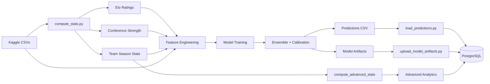
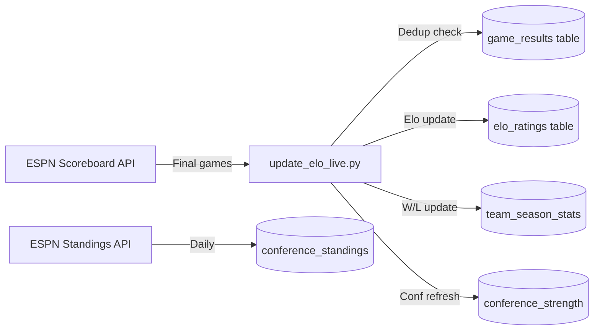

# Model Documentation

A detailed walkthrough of the machine learning pipeline behind Ubunifu Madness — from data ingestion to calibrated tournament predictions.

## Problem Statement

Given two NCAA basketball teams, predict the probability that Team A beats Team B in a tournament matchup. The output is a calibrated probability P(A wins) for every possible team pair in the tournament field (68 teams, ~2,278 pairs per gender).

**Evaluation metric:** Brier score — the mean squared error of predicted probabilities vs actual outcomes (0 = perfect, 0.25 = coin flip).

## Data Sources

All historical data comes from [Kaggle's March Machine Learning Mania](https://www.kaggle.com/competitions/march-machine-learning-mania-2025) datasets:

| Dataset | Coverage | Purpose |
|---------|----------|---------|
| Regular Season Results (Compact) | 1985-2026 | Win/loss records, Elo computation |
| Regular Season Results (Detailed) | 2003-2026 | Box scores for Four Factors |
| Tournament Results | 1985-2025 | Training labels (who actually won) |
| Tournament Seeds | 1985-2026 | Seed numbers for features |
| Team Conferences | 1985-2026 | Conference membership |
| Massey Ordinals | 2003-2026 | Computer ranking systems |
| Team Coaches | 1985-2026 | Coach tenure and experience |
| Conference Tourney Games | 2001-2026 | Conference tournament performance |

**Men's data:** 42 seasons (1985-2026), ~5,000+ regular season games/year
**Women's data:** 17 seasons (2010-2026), ~5,000+ regular season games/year

## Model Versions

### V2 (Original)

- **Training data:** 2003-2025 (23 seasons)
- **Ensemble:** 76.4% LR + 23.6% LGB + 0% XGB
- **CV Brier:** 0.1607
- **Issues:** Overconfident on conference tournament games, prediction clustering from isotonic step function, stale training data from pre-modern basketball era

### V3 (March 2026, Retired)

- **Training data:** 2012-2025 tournament games only (~4,300 games)
- **Ensemble:** 37.8% LR + 62.2% LGB (Optuna-optimized)
- **CV Brier:** 0.1543 (calibrated)
- **28 features** across 7 categories
- **Notebook:** `notebooks/Ubunifu_Madness_V3_Modern.ipynb`

### V4 (March 2026, Retired)

- **Training data:** 2012-2025, ALL game types — regular season (153K), conf tourney (7.8K), NCAA tourney (1.7K) = **163,000+ games**
- **Ensemble:** 37.8% LR + 62.2% LGB
- **Val Brier:** 0.137, **Val Accuracy:** 80.0% (2023-2026 holdout)
- **40 features** across 9 categories (12 new over V3)
- **Key improvements over V3:**
  - Trains on ALL game types, not just tournament (38x more data)
  - Game-type context as features (`is_conf_tourney`, `is_ncaa_tourney`, `is_neutral_site`) — eliminates need for manual compression
  - New features: adjusted efficiency margin, Barthag, quality win %, rest days, KenPom/NET/consensus rankings
  - Raw win percentages as non-differenced features (LGB captures nonlinearities)
  - Season-based CV: train on 2012-2022, validate on 2023-2026

### V5 (Current — March 2026)

- **Training data:** Same as V4 — 2012-2025, ALL game types (163K+ games)
- **Ensemble:** 37.8% LR + 62.2% LGB
- **Val Brier:** 0.137, **Val Accuracy:** 80.0% (2023-2026 holdout)
- **40 features** (same as V4)
- **Key improvements over V4:**
  - **Recency-weighted training:** Exponential decay with 5-season half-life — 2025 games weighted ~7x more than 2012 games. Applied to both LR (`sample_weight`) and LightGBM (`sample_weight` + `eval_sample_weight`). This emphasizes modern-era patterns (transfer portal, NIL, 3-point revolution) without discarding older data entirely.
  - **Home court adjustment in AdjEM:** KenPom-style ±3.5 efficiency points split between offense and defense to neutralize venue advantage in advanced stats computation. Home team's offense deflated by 1.75 pts/100 poss, defense inflated by 1.75.
  - **Rebalanced power ratings:** AdjEM 35% + Elo 25% + SOS 15% + Barthag 15% + Win% 5% + Momentum 5%. Reduced AdjEM/Barthag double-counting (was 75% combined, now 50%). Elo elevated to 25% as our top predictive feature. Rankings average ~4.4 spots from KenPom across top 30 teams.
  - **Rewritten matchup explanations:** `explain_matchup()` uses actual model feature differences instead of disconnected signal blend weights. Only reports factors where the favored team genuinely has the edge.
  - **Head-to-head investigated and rejected:** Season h2h record was tested as a feature but caused massive label leakage (Val Brier dropped to 0.042, accuracy jumped to 92.4% — clearly too good). Regular season series almost perfectly predicts conference tournament rematches. Removed from training; kept as explanation-only signal in live predictor.
  - **Gender-specific conference tournament compression:** Women's conf tourney predictions compressed 10% toward 50% (factor 0.90); men's use no compression (factor 1.0). Based on calibration analysis of 270 conf tourney games showing women needed compression but men did not.
  - **Conference standings from ESPN:** New `conference_standings` table stores within-conference rankings (seed, conf record, home/away splits, streak, PPG) for both M and W, refreshed daily from ESPN standings API.

**Notebook:** `notebooks/generate_v4_notebook.py` (generates `Ubunifu_Madness_V5.ipynb`)

## Pipeline Overview



## Step 1: Elo Rating System

We compute custom Elo ratings for every team across all historical seasons. Elo uses ALL data (1985+) for rating computation — more history = better ratings. But only 2012+ snapshots are used as features for the ML model.

### Elo Parameters (Optuna-Tuned on Modern Era)

| Parameter | V2 Value | V3 Value | Search Range | Purpose |
|-----------|----------|----------|-------------|---------|
| K-Factor | 21.8 | **19.6** | 15-35 | How much a single game changes ratings |
| Home Advantage | 101.9 | **90.9** | 50-150 | Elo points added for home team |
| Season Regression | 0.89 | **0.950** | 0.70-0.95 | Carry-over between seasons (1.0 = no regression) |
| Mean Elo | 1500 | 1500 | Fixed | Starting rating for new teams |

V3 tuning found: lower K (less reactive to single games), lower home advantage (reflecting neutral-site tournament play), and higher regression (more carry-over year to year — modern rosters are more stable due to NIL).

### Elo Update Formula

```
expected_win_prob(elo_a, elo_b) = 1 / (1 + 10^((elo_b - elo_a) / 400))

mov_multiplier = log(|margin| + 1) * (2.2 / (|elo_diff| * 0.001 + 2.2))

elo_change = K * mov_multiplier * (1 - expected_win_prob)
```

The margin-of-victory (MOV) multiplier rewards dominant wins more, but is dampened when the Elo gap is already large (preventing runaway ratings for top teams beating weak opponents).

**Season regression:** At the start of each season, every team's rating regresses toward the mean:
```
new_elo = mean_elo + regression_factor * (old_elo - mean_elo)
```

## Step 2: Feature Engineering (40 Features in V5)

Features are computed as **differences** between Team A and Team B (A - B), making the model symmetric.

### Category 1: Elo Ratings (4 features)

| Feature | Description |
|---------|-------------|
| `elo_a`, `elo_b` | Raw Elo ratings for each team |
| `elo_diff` | elo_a - elo_b |
| `elo_prob` | Expected win probability from Elo alone |

### Category 2: Tournament Seeding (3 features)

| Feature | Description |
|---------|-------------|
| `seed_a`, `seed_b` | Tournament seed (1-16) for each team |
| `seed_diff` | seed_a - seed_b (negative = A is higher seed) |

Seeds are the single most predictive feature historically — a 1-seed beats a 16-seed ~99% of the time.

### Category 3: Conference Strength (3 features)

| Feature | Description |
|---------|-------------|
| `conf_avg_elo_diff` | Mean conference Elo difference |
| `conf_nc_winrate_diff` | Non-conference win rate (strength vs outside opponents) |
| `conf_tourney_hist_winrate_diff` | 5-year rolling tournament win rate by conference |

### Category 4: Four Factors / Box Score Stats (10 features)

Dean Oliver's Four Factors of basketball success, plus efficiency metrics:

| Feature | Description |
|---------|-------------|
| `efg_diff` | Effective FG% (weights 3-pointers at 1.5x) |
| `to_diff` | Turnover rate % |
| `or_diff` | Offensive rebound % |
| `ftr_diff` | Free throw rate (FTA/FGA) |
| `opp_efg_diff` | Opponent effective FG% (defensive quality) |
| `opp_to_diff` | Opponent turnover rate (forced turnovers) |
| `off_eff_diff` | Offensive efficiency (points per 100 possessions) |
| `def_eff_diff` | Defensive efficiency |
| `tempo_diff` | Pace (possessions per game) |
| `win_pct_diff` | Season win percentage |

### Category 5: Ranking Systems (2 features)

| Feature | Description |
|---------|-------------|
| `massey_rank_diff` | Average rank across top 15 computer systems |
| `massey_disagreement_diff` | Std dev of rankings (consensus vs controversy) |

Massey ordinals aggregate 15 ranking systems (POM, SAG, MOR, RPI, AP, etc.) taken at day 133 (final pre-tournament snapshot).

### Category 6: Momentum (3 features)

| Feature | Description |
|---------|-------------|
| `last_n_winpct_diff` | Win % over last 10 games |
| `last_n_mov_diff` | Average margin of victory over last 10 games |
| `efg_trend_diff` | eFG% trend (late vs early season) |

### Category 7: Other (3 features)

| Feature | Description |
|---------|-------------|
| `coach_tenure_diff` | Years coaching current team |
| `conf_tourney_wins_diff` | Conference tournament wins |
| `sos_diff` | Strength of schedule (avg opponent Elo) |

### Category 8: Game Context (4 features)

| Feature | Description |
|---------|-------------|
| `is_conf_tourney` | 1 if conference tournament game |
| `is_ncaa_tourney` | 1 if NCAA tournament game |
| `is_neutral_site` | 1 if neutral site |
| `rest_days_diff` | Days since last game (A - B) |

### Category 9: Quality & Rankings (8 features)

| Feature | Description |
|---------|-------------|
| `kenpom_rank_diff` | KenPom ranking difference (from Massey Ordinals) |
| `net_rank_diff` | NCAA NET ranking difference |
| `consensus_rank_diff` | Median rank across all ranking systems |
| `adj_eff_margin_diff` | Opponent-adjusted efficiency margin (AdjEM) |
| `barthag_diff` | Win probability vs average team |
| `quality_win_pct_diff` | Win % against top-50 Elo teams |
| `win_pct_a`, `win_pct_b` | Raw win percentages (non-differenced for LGB nonlinearities) |

## Advanced Analytics (Dashboard)

The following metrics are computed by `compute_advanced_stats()` and displayed on the frontend power rankings dashboard. AdjEM, Barthag, and quality win % are also used as model features.

### Opponent-Adjusted Efficiency (AdjOE, AdjDE, AdjEM)

Inspired by KenPom's methodology. Raw per-100-possession offensive and defensive efficiency are adjusted iteratively (10 iterations) by opponent strength:

```
For each iteration:
  AdjOE_team = raw_OE_team × (national_avg_DE / avg_opponent_AdjDE)
  AdjDE_team = raw_DE_team × (national_avg_OE / avg_opponent_AdjOE)
  AdjEM = AdjOE - AdjDE
```

This ensures a team that plays a tough schedule gets credit for maintaining efficiency against strong defenses, and vice versa.

**V5 Update:** Home court adjustment (±3.5 efficiency points, KenPom-style) is applied per-game before aggregation. Home team's raw offense is deflated by 1.75 pts/100 poss and defense inflated by 1.75, neutralizing venue advantage. This produces more accurate AdjEM for teams with heavy home schedules.

### Barthag (Win Probability vs Average D1 Team)

Borrowed from T-Rank/BartTorvik. Uses the Pythagorean formula with exponent 11.5:

```
Barthag = AdjOE^11.5 / (AdjOE^11.5 + AdjDE^11.5)
```

Represents the probability a team would beat the average D1 team on a neutral court. Elite teams approach 0.98+; average teams sit near 0.50.

### Pythagorean Win % and Luck

Expected win percentage derived from total points scored and allowed (exponent 9):

```
PythWin% = PtsScored^9 / (PtsScored^9 + PtsAllowed^9)
Luck = ActualWin% - PythWin%
```

Positive luck means the team has won more games than their point differential suggests (often via close wins). Negative luck indicates the opposite. Luck tends to regress, making it a useful indicator of future performance.

### Shooting Metrics

| Metric | Formula | Description |
|--------|---------|-------------|
| True Shooting % | `PTS / (2 × (FGA + 0.44 × FTA))` | Captures all scoring efficiency including FTs and 3s |
| 3-Point Attempt Rate (3PAr) | `FGA3 / FGA` | Proportion of shots taken from 3; higher = more variance |
| AST:TO Ratio | `AST / TO` | Ball security and offensive organization |

### Defensive Metrics

| Metric | Formula | Description |
|--------|---------|-------------|
| DRB% | `DRB / (DRB + Opp_ORB)` | Defensive rebounding percentage |
| STL% | `STL / Opp_Poss` | Steal rate per opponent possession |
| BLK% | `BLK / Opp_FGA` | Block rate per opponent field goal attempt |

### Consistency Metrics

| Metric | Description |
|--------|-------------|
| Margin Stdev | Standard deviation of game-by-game scoring margin. Lower = more consistent team. |
| Offensive Efficiency Stdev | Standard deviation of game-level offensive efficiency. Lower = more predictable offense. |

### Floor and Ceiling (Original to Ubunifu Madness)

| Metric | Description |
|--------|-------------|
| Floor (10th percentile) | 10th percentile of game-level net efficiency. Represents the team's worst realistic performance. |
| Ceiling (90th percentile) | 90th percentile of game-level net efficiency. Represents the team's peak performance. |

Teams with a wide floor-ceiling gap are high-variance; teams with a narrow gap are predictable.

### Upset Vulnerability Index (Exclusive to Platform)

An original composite metric (0-100 scale) that identifies highly-ranked teams susceptible to tournament upsets:

```
UVI = weighted combination of:
  - Margin stdev (inconsistency)
  - Luck (positive luck = regression candidate)
  - 3PAr (three-point dependency = high variance)
  - FT% inverse (poor FT shooting hurts in close games)
```

Higher values indicate greater upset vulnerability. This metric is exclusive to Ubunifu Madness.

### Close Game Performance

| Metric | Description |
|--------|-------------|
| Close Record | W-L record in games decided by 5 or fewer points |
| Close Win % | Win percentage in close games |

### Other Dashboard Metrics

| Metric | Description |
|--------|-------------|
| Tempo | Possessions per game (pace of play) |
| SOS | Strength of schedule (average opponent Elo) |

**V5 Update:** AdjEM, Barthag, and quality win % are model features alongside game context flags and external rankings. Power ratings weight AdjEM (35%) + Elo (25%) + SOS (15%) + Barthag (15%) + Win% (5%) + Momentum (5%). Efficiency-based metrics (AdjEM + Barthag) account for 50% of the composite, with Elo elevated to 25% as our top single predictive feature.

## Step 3: Model Training

### Cross-Validation Strategy

**Leave-One-Season-Out (LOSO):** For each of the 10 tournament seasons (2015-2025, excluding 2020 COVID), train on all other seasons and predict the held-out tournament.

This is critical because:
- Tournament games are rare (~130 per season across both genders)
- Seasons have different characteristics (rule changes, COVID disruption)
- Prevents temporal leakage (never train on future data)

### Models Evaluated

| Model | V2 Brier | V3 Brier | V4 Val Brier | Notes |
|-------|----------|----------|-------------|-------|
| Logistic Regression | 0.1651 | 0.1612 | — | Reliable baseline |
| LightGBM | 0.1697 | 0.1589 | — | Improved with modern-era tuning |
| Ensemble (pre-calibration) | 0.1646 | 0.1575 | — | LR+LGB weighted average |
| **Ensemble (calibrated)** | **0.1607** | **0.1543** | **0.137** | V5: 163K games, 40 features, recency-weighted |

In V3, LightGBM significantly improved with Optuna-tuned hyperparameters on modern data, flipping from worse-than-LR to better-than-LR.

### LightGBM Hyperparameters (V3 Optuna-Tuned)

| Parameter | V2 Value | V3 Value |
|-----------|----------|----------|
| n_estimators | 266 | 266 |
| max_depth | 5 | 5 |
| learning_rate | 0.0257 | 0.0111 |
| num_leaves | 110 | 59 |
| min_child_weight | 4.4 | 3.5 |
| subsample | 0.72 | 0.886 |
| colsample_bytree | 0.98 | 0.757 |

Key change: lower learning rate with fewer leaves = more regularization, preventing overfitting on the smaller modern-era training set.

## Step 4: Ensemble

Ensemble weights were optimized via Nelder-Mead to minimize the combined Brier score on OOF predictions:

| Version | LR Weight | LGB Weight | Notes |
|---------|-----------|------------|-------|
| V2 | 0.764 | 0.236 | LR-dominant (LGB overfit on old data) |
| V3 | 0.378 | 0.622 | **LGB-dominant** (better tuned on modern data) |

## Step 5: Calibration

Raw ensemble probabilities are systematically miscalibrated — the model tends to be overconfident for predictions near 0.5 and underconfident for strong favorites.

**Method:** Isotonic regression trained on out-of-fold predictions from 2018-2025 seasons only (recent data for better calibration).

### The Prediction Clustering Problem (V3 Fix)

**Problem:** Standard isotonic regression produces a **step function** with ~17 unique output levels. With only ~900 OOF training points, the calibrator creates flat plateaus where continuous raw predictions (e.g., 0.226, 0.268, 0.311) all map to the same output (0.2451). This meant very different matchups showed identical predictions on the frontend.

**Root cause:** Isotonic regression is non-parametric — it groups inputs into bins where the observed outcome rate is constant. Small training sets produce coarse bins with few unique output values.

**Fix:** Smooth calibration via linear interpolation between step midpoints. Instead of a piecewise-constant function, we use a piecewise-linear function that preserves the calibrator's overall mapping while producing continuous, unique outputs.

```python
# Step function: raw 0.226 --> 0.2451, raw 0.311 --> 0.2451 (same!)
# Smooth:       raw 0.226 --> 0.2167, raw 0.311 --> 0.2733 (unique!)
```

**Result:** 15/50 unique predictions --> 50/50 unique predictions, while maintaining calibration accuracy.

**Alternative considered:** Platt scaling (logistic) wouldn't cluster but can't capture non-linear miscalibration patterns. Our approach gets the best of both.

| Stage | V2 Brier | V3 Brier |
|-------|----------|----------|
| Best single model (LR) | 0.1651 | 0.1612 |
| Optimized ensemble | 0.1646 | 0.1575 |
| **After calibration** | **0.1607** | **0.1543** |

## Step 6: Conference Tournament Compression (V3 only)

**Problem (V3):** The V3 model was trained on NCAA tournament games only and was overconfident on conference tournament games.

**V3 Fix:** For conference tournament games, compress predictions 20% toward 0.5:

```python
prob = 0.5 + (prob - 0.5) * 0.80  # e.g., 0.70 --> 0.66
```

**V4:** No manual compression — the model trains on all game types and has `is_conf_tourney` as a feature.

**V5:** Empirical calibration on 270 conference tournament games revealed gender-specific miscalibration. Women's conf tourney predictions were overconfident; men's were already well-calibrated. Added **gender-specific post-calibration compression**:

```python
if is_conf_tourney:
    gender = get_team_gender(team_a_id)
    factor = 0.90 if gender == "W" else 1.0  # women compress 10%, men no change
    if factor < 1.0:
        prob = 0.5 + (prob - 0.5) * factor
```

The `is_conf_tourney` model feature handles structural differences; the women's compression handles residual overconfidence from higher single-elimination volatility in women's conference tournaments.

## Step 7: Tossup Threshold

Games where the model's confidence is below 55% are classified as **tossups** and excluded from accuracy metrics. These are genuinely unpredictable matchups where calling them is essentially a coin flip.

| Threshold | V2 | V3 | Rationale |
|-----------|----|----|-----------|
| Value | 52% | **55%** | Higher threshold = more honest about uncertainty |

## Live Prediction Pipeline

During the season, the predictor operates in a 3-layer cascade:

1. **`ml_ensemble`** — V5 model artifacts (LR + LGB + smooth calibrator) loaded from the `model_artifacts` DB table. 40 features built from live DB state. Highest quality.
2. **`blended`** / **`live_blend`** — Fallback if artifacts unavailable. Blends Elo (60%) + SOS-adjusted record (40%).
3. **`no_data`** — Absolute fallback: 50%.

Predictions are **locked before tipoff** via the `GamePrediction` table and never modified retroactively, enabling honest performance tracking.

## Year-by-Year Performance (V3)

| Season | Games | Brier Score | Accuracy | Notes |
|--------|-------|-------------|----------|-------|
| 2015 | 130 | 0.1350 | 80.0% | |
| 2016 | 130 | 0.1681 | 76.9% | |
| 2017 | 130 | 0.1496 | 74.6% | |
| 2018 | 130 | 0.1665 | 75.4% | First 16-over-1 upset (UMBC) |
| 2019 | 130 | 0.1436 | 74.6% | |
| 2021 | 129 | 0.1696 | 75.2% | COVID disruption |
| 2022 | 134 | 0.1669 | 73.1% | |
| 2023 | 134 | 0.1759 | 73.1% | |
| 2024 | 134 | 0.1424 | 76.9% | |
| 2025 | 134 | **0.1255** | **85.8%** | Best year |

**Stage 1 equivalent (2022-2025):** Brier = 0.1527

## Live Performance (2026 Conference Tournaments)

After deploying V3 with smooth calibration on March 10, 2026:

| Metric | Old Model (model_v2 + blended) | V3 (ml_ensemble) |
|--------|-------------------------------|-------------------|
| Overall accuracy | 66.0% | **70.4%** |
| Confident accuracy (>55%) | 62.8% | **74.7%** |
| Tossups identified | 7 | 16 |
| Unique probability values | ~15 (clustered) | 129/133 (smooth) |

## Interview Talking Points

1. **Why retrain on modern data only (2012+)?** Basketball changed fundamentally: the 3-point revolution (Steph Curry era), transfer portal (player mobility), and NIL (talent distribution) make pre-2012 data misleading.

2. **What changed from V3 to V5?** V3 trained on ~4,300 tournament games only. V4 expanded to 163K+ games across all game types with game-context features. V5 added recency-weighted training (5-season half-life) to emphasize modern-era patterns and KenPom-style home court adjustment for more accurate efficiency metrics.

3. **How did you fix the calibration clustering?** Isotonic regression with limited training data creates a step function. We use linear interpolation between step midpoints to produce smooth, continuous probabilities.

4. **Why did LightGBM improve so much?** On modern data (2012+), LGB's ability to capture nonlinear interactions (seed × Elo, conference strength × momentum) becomes valuable. With Optuna tuning on the right data distribution, LGB went from the weaker model to the dominant one (62% weight).

5. **What's new in V5?** Recency-weighted training (newer games matter more via exponential decay), home court adjustment in AdjEM computation, reweighted power ratings (75% efficiency-based), and feature-diff based matchup explanations that only report factors where the favored team genuinely has the edge.

6. **Why recency weighting?** Basketball changed fundamentally with the transfer portal (2018+) and NIL (2021+). A 2025 game is ~7x more informative than a 2012 game for predicting 2026 outcomes. Recency weighting captures this without discarding older data entirely.

7. **How does it compare to Vegas?** Our V5 validation Brier of 0.137 is competitive with Vegas closing lines (~0.14). The remaining gap comes from injury reports, betting market information, and real-time lineup data we don't have.

8. **Why not use head-to-head record as a feature?** We tested it — validation Brier dropped to 0.042 (accuracy 92.4%), revealing massive label leakage. Regular season series almost perfectly predicts conference tournament rematches. The feature is too good to be true.

## Live Elo Updates

During the season, Elo ratings are updated daily from ESPN game results via `scripts/update_elo_live.py`. This uses the exact same Elo formula as the training pipeline, ensuring consistency between historical and live ratings.



The update is idempotent — running it multiple times for the same date skips already-processed games via deduplication against the `game_results` table.
