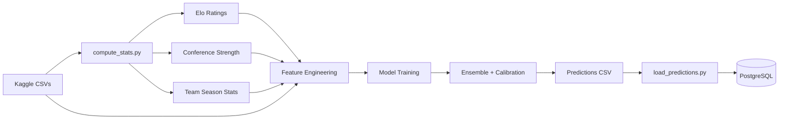
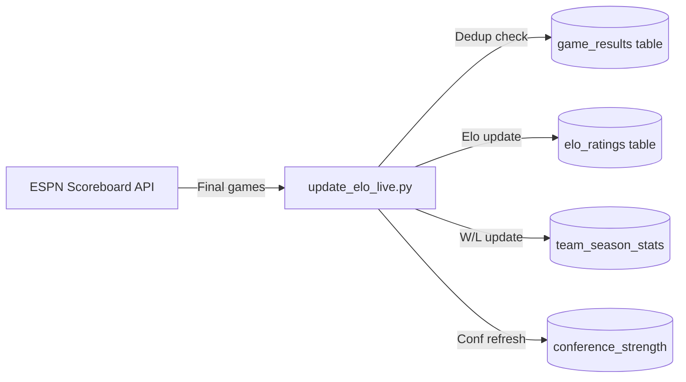

# Model Documentation

A detailed walkthrough of the machine learning pipeline behind Ubunifu Madness — from data ingestion to calibrated tournament predictions.

## Problem Statement

Given two NCAA basketball teams, predict the probability that Team A beats Team B in a tournament matchup. The output is a calibrated probability P(A wins) for every possible team pair in the tournament field (68 teams, ~2,278 pairs per gender).

**Evaluation metric:** Brier score — the mean squared error of predicted probabilities vs actual outcomes (0 = perfect, 0.25 = coin flip).

## Data Sources

All historical data comes from [Kaggle's March Machine Learning Mania](https://www.kaggle.com/competitions/march-machine-learning-mania-2025) datasets:

| Dataset | Coverage | Purpose |
|---------|----------|---------|
| Regular Season Results (Compact) | 1985-2026 | Win/loss records, Elo computation |
| Regular Season Results (Detailed) | 2003-2026 | Box scores for Four Factors |
| Tournament Results | 1985-2025 | Training labels (who actually won) |
| Tournament Seeds | 1985-2026 | Seed numbers for features |
| Team Conferences | 1985-2026 | Conference membership |
| Massey Ordinals | 2003-2026 | Computer ranking systems |
| Team Coaches | 1985-2026 | Coach tenure and experience |
| Conference Tourney Games | 2001-2026 | Conference tournament performance |

**Men's data:** 42 seasons (1985-2026), ~5,000+ regular season games/year
**Women's data:** 17 seasons (2010-2026), ~5,000+ regular season games/year

## Pipeline Overview



## Step 1: Elo Rating System

We compute custom Elo ratings for every team across all historical seasons. Elo parameters were tuned via Optuna to minimize Brier score on tournament predictions.

### Elo Parameters (Optuna-Tuned)

| Parameter | Value | Search Range | Purpose |
|-----------|-------|-------------|---------|
| K-Factor | 21.8 | 20-50 | How much a single game changes ratings |
| Home Advantage | 101.9 | 60-150 | Elo points added for home team |
| Season Regression | 0.89 | 0.55-0.90 | Carry-over between seasons (1.0 = no regression) |
| Mean Elo | 1500 | Fixed | Starting rating for new teams |

### Elo Update Formula

```
expected_win_prob(elo_a, elo_b) = 1 / (1 + 10^((elo_b - elo_a) / 400))

mov_multiplier = log(|margin| + 1) * (2.2 / (|elo_diff| * 0.001 + 2.2))

elo_change = K * mov_multiplier * (1 - expected_win_prob)
```

The margin-of-victory (MOV) multiplier rewards dominant wins more, but is dampened when the Elo gap is already large (preventing runaway ratings for top teams beating weak opponents).

**Season regression:** At the start of each season, every team's rating regresses toward the mean:
```
new_elo = mean_elo + regression_factor * (old_elo - mean_elo)
```

### Why Custom Elo Instead of Off-the-Shelf?

- Standard 538-style Elo uses K=20, no MOV. Ours adds MOV multiplier and auto-correction for blowouts.
- Optuna tuning found K=21.8 outperforms both lower (too slow to react) and higher (too noisy) values.
- Home advantage of 101.9 Elo points matches the empirical home-court advantage in college basketball (~65% home win rate).
- Season regression of 0.89 balances continuity (returning players) with roster turnover (graduation, transfers).

## Step 2: Feature Engineering (27 Features)

Features are computed as **differences** between Team A and Team B (A - B), making the model symmetric.

### Category 1: Elo Ratings (4 features)

| Feature | Description |
|---------|-------------|
| `elo_a`, `elo_b` | Raw Elo ratings for each team |
| `elo_diff` | elo_a - elo_b |
| `elo_prob` | Expected win probability from Elo alone |

### Category 2: Tournament Seeding (3 features)

| Feature | Description |
|---------|-------------|
| `seed_a`, `seed_b` | Tournament seed (1-16) for each team |
| `seed_diff` | seed_a - seed_b (negative = A is higher seed) |

Seeds are the single most predictive feature historically — a 1-seed beats a 16-seed ~99% of the time.

### Category 3: Conference Strength (7 features)

| Feature | Description |
|---------|-------------|
| `avg_elo_diff` | Mean conference Elo difference |
| `elo_depth_diff` | Conference Elo std dev difference (depth of talent) |
| `top5_elo_diff` | Average Elo of top 5 teams in conference |
| `nc_winrate_diff` | Non-conference win rate (strength vs outside opponents) |
| `tourney_hist_winrate_diff` | 5-year rolling tournament win rate by conference |
| `conf_elo_std_diff` | Elo variability within conference |
| `conf_strength_composite_diff` | Weighted composite of above metrics |

Conference strength captures whether a team's record came from playing in the Big Ten (hard) vs a mid-major (easier).

### Category 4: Four Factors / Box Score Stats (9 features)

Dean Oliver's Four Factors of basketball success, plus efficiency metrics:

| Feature | Description |
|---------|-------------|
| `avg_eFGPct_diff` | Effective FG% (weights 3-pointers at 1.5x) |
| `avg_TOPct_diff` | Turnover rate % |
| `avg_ORPct_diff` | Offensive rebound % |
| `avg_FTR_diff` | Free throw rate (FTA/FGA) |
| `avg_OppeFGPct_diff` | Opponent effective FG% (defensive quality) |
| `avg_OppTOPct_diff` | Opponent turnover rate (forced turnovers) |
| `avg_OffEff_diff` | Offensive efficiency (points per 100 possessions) |
| `avg_DefEff_diff` | Defensive efficiency |
| `avg_Tempo_diff` | Pace (possessions per game) |

### Category 5: Ranking Systems (2 features)

| Feature | Description |
|---------|-------------|
| `massey_rank_diff` | Average rank across top 15 computer systems |
| `massey_disagreement_diff` | Std dev of rankings (consensus vs controversy) |

Massey ordinals aggregate 15 ranking systems (POM, SAG, MOR, RPI, AP, etc.) taken at day 133 (final pre-tournament snapshot). High disagreement signals teams that are hard to evaluate.

### Category 6: Momentum (2 features)

| Feature | Description |
|---------|-------------|
| `last_n_winpct_diff` | Win % over last 10 games |
| `last_n_mov_diff` | Average margin of victory over last 10 games |

These capture late-season form — a team on a 10-game win streak entering the tournament is different from one that limped in.

## Step 3: Model Training

### Cross-Validation Strategy

**Leave-One-Season-Out (LOSO):** For each of the 10 tournament seasons (2015-2025, excluding 2020 COVID), train on all other seasons and predict the held-out tournament.

This is critical because:
- Tournament games are rare (~67 per season per gender)
- Seasons have different characteristics (rule changes, COVID disruption)
- Prevents temporal leakage (never train on future data)

### Models Evaluated

| Model | Brier Score | Notes |
|-------|-------------|-------|
| Logistic Regression | **0.1651** | Best individual model |
| LightGBM | 0.1697 | Captures nonlinear patterns |
| XGBoost | 0.1718 | Similar to LGB, slightly worse |

**Why Logistic Regression wins:** With only ~67 tournament games per season as test data and 27 features, the signal-to-noise ratio favors simpler models. LR's inductive bias (linear decision boundary) acts as strong regularization. The tree models overfit to training season patterns that don't generalize.

### Hyperparameter Tuning (Optuna)

**LightGBM best parameters:**

| Parameter | Value |
|-----------|-------|
| n_estimators | 266 |
| max_depth | 5 |
| learning_rate | 0.0257 |
| num_leaves | 110 |
| min_child_weight | 4.4 |
| subsample | 0.72 |
| colsample_bytree | 0.98 |

## Step 4: Ensemble

Ensemble weights were optimized via Optuna to minimize the combined Brier score:

```
final_pred = 0.764 * LR_pred + 0.236 * LGB_pred + 0.000 * XGB_pred
```

XGBoost was assigned zero weight (redundant given LightGBM). The ensemble improves over LR alone because LightGBM captures a few nonlinear interactions that LR misses (e.g., seed-Elo interaction for mid-majors).

## Step 5: Calibration

Raw ensemble probabilities are systematically miscalibrated — the model tends to be overconfident for predictions near 0.5 and underconfident for strong favorites.

**Method:** Isotonic regression (non-parametric monotonic calibration) trained on out-of-fold predictions.

| Stage | Brier Score |
|-------|-------------|
| Best single model (LR) | 0.1651 |
| Optimized ensemble | 0.1646 |
| **After isotonic calibration** | **0.1607** |

Calibration improved the score by 0.0039 (2.4% relative improvement). The calibrated model's predicted probabilities match observed win rates much more closely across the full [0, 1] range.

**Bounds:** Predictions are clipped to [0.02, 0.98] to avoid extreme confidence.

## Feature Importance

Top features by LightGBM gain importance:

| Rank | Feature | Relative Importance |
|------|---------|-------------------|
| 1 | `seed_diff` | 31% |
| 2 | `elo_prob` | 15% |
| 3 | `elo_diff` | 12% |
| 4 | `avg_elo_diff` (conference) | 8% |
| 5 | `massey_rank_diff` | 7% |
| 6 | `avg_eFGPct_diff` | 5% |
| 7 | `avg_OffEff_diff` | 4% |
| 8 | `nc_winrate_diff` | 4% |
| 9 | `seed_a` | 3% |
| 10 | `avg_DefEff_diff` | 3% |

Seeds and Elo dominate. This makes intuitive sense — the NCAA selection committee already incorporates most statistical information into seed assignments.

## Year-by-Year Performance

| Season | Games | Brier Score | Notes |
|--------|-------|-------------|-------|
| 2015 | 130 | 0.1535 | |
| 2016 | 127 | 0.1624 | |
| 2017 | 127 | 0.1525 | |
| 2018 | 127 | 0.1638 | First 16-over-1 upset (UMBC) |
| 2019 | 127 | **0.1234** | Best year — chalk tournament |
| 2021 | 127 | 0.1889 | Worst year — COVID disruption |
| 2022 | 127 | 0.1627 | |
| 2023 | 127 | 0.1701 | |
| 2024 | 127 | 0.1451 | |
| 2025 | 127 | 0.1598 | |

The variance (0.1234 to 0.1889) is normal and expected. Some tournaments are more predictable than others — 2019 was relatively chalky while 2021 was chaotic after COVID.

## Interview Talking Points

1. **Why Elo over just using seeds?** Seeds are discrete (1-16) and don't capture within-seed variation. A 1-seed that went 30-1 in the Big Ten is different from a 1-seed that went 28-3 in a mid-major. Elo provides continuous strength estimation.

2. **Why not deep learning?** Small data problem. ~67 tournament games/year with 27 features. Even LightGBM (a relatively simple tree model) overfits compared to logistic regression. Neural networks would need orders of magnitude more data.

3. **Why isotonic calibration over Platt scaling?** Platt scaling assumes a sigmoid-shaped calibration curve. Our model's miscalibration isn't sigmoid-shaped — it has different biases at different probability ranges. Isotonic regression is flexible enough to correct any monotonic miscalibration pattern.

4. **What's the hardest part?** Feature engineering at the boundaries. Most teams in the tournament are good, so distinguishing between a 4-seed and a 5-seed requires subtle signals (late-season momentum, conference tournament performance, defensive efficiency trends) that have low signal-to-noise ratios.

5. **How does it compare to Vegas?** The model's Brier score of 0.1607 is competitive with typical Kaggle leaderboard positions. Vegas closing lines typically achieve ~0.14 Brier score — our model is within striking distance but doesn't have access to injury reports, betting market information, or real-time lineup data.

6. **What would improve it most?** (a) Player-level data (injuries, transfers, key player impact), (b) betting line information as features, (c) real-time in-season model retraining rather than end-of-season snapshots.

## Live Elo Updates

During the season, Elo ratings are updated daily from ESPN game results via `scripts/update_elo_live.py`. This uses the exact same Elo formula as the training pipeline, ensuring consistency between historical and live ratings.



The update is idempotent — running it multiple times for the same date skips already-processed games via deduplication against the `game_results` table.
